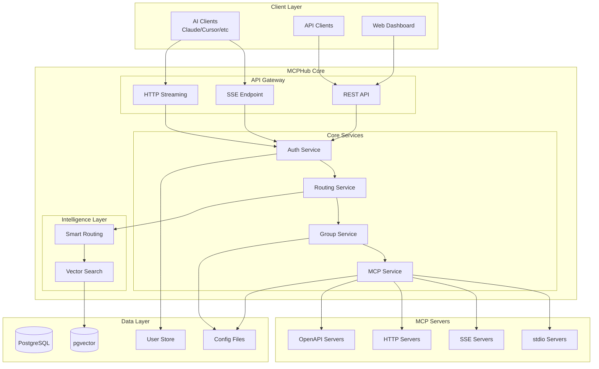

# System Overview

## MCPHub High-Level Architecture

MCPHub is a sophisticated orchestration platform that bridges AI clients with multiple Model Context Protocol (MCP) servers, providing unified access, intelligent routing, and comprehensive management capabilities.

## 🎯 System Goals

1. **Unified Access**: Single endpoint for multiple MCP servers
2. **Protocol Agnostic**: Support stdio, SSE, HTTP, and OpenAPI transports
3. **Intelligent Discovery**: AI-powered tool finding via semantic search
4. **Scalable Management**: Hot-reload configuration and dynamic server lifecycle
5. **Secure Multi-tenancy**: User isolation with role-based access control
6. **Production Ready**: Docker deployment with monitoring and logging

## 🏗️ Architecture Overview



## 🔧 Core Components

### 1. API Gateway Layer
The entry point for all client interactions:

- **REST API** (`/api/*`): Management operations, configuration, monitoring
- **SSE Endpoint** (`/sse/*`): Server-Sent Events for real-time MCP communication
- **HTTP Streaming** (`/mcp/*`): Streamable HTTP for MCP protocol messages

### 2. Authentication & Authorization
Multi-layered security system:

- **JWT Authentication**: Stateless token-based auth
- **Bearer Tokens**: API key authentication for programmatic access
- **Role-Based Access**: Admin and user roles with different permissions
- **User Context**: Request-scoped user isolation

### 3. Routing Engine
Intelligent request routing:

- **Direct Routing**: Route to specific MCP server by name
- **Group Routing**: Route to server groups by ID or name
- **Smart Routing**: AI-powered tool discovery and routing
- **Global Routing**: Access all available servers (configurable)

### 4. MCP Service Core
Server lifecycle management:

- **Process Management**: Spawn and manage child processes for stdio servers
- **Connection Pooling**: Maintain persistent connections to remote servers
- **Protocol Abstraction**: Unified interface for different transport types
- **Keep-Alive**: Automatic ping/pong for connection health

### 5. Intelligence Layer
AI-powered capabilities:

- **Vector Embeddings**: Convert tools to semantic vectors
- **Similarity Search**: Find relevant tools using cosine similarity
- **Dynamic Thresholds**: Adaptive filtering for result quality
- **Tool Caching**: Performance optimization for frequent queries

### 6. Data Management
Persistent storage and configuration:

- **PostgreSQL**: Primary database for vector embeddings
- **pgvector Extension**: Vector similarity search support
- **JSON Configuration**: Server and group definitions
- **User Database**: Authentication and authorization data

## 📊 Key Architectural Patterns

### Service Registry Pattern
```typescript
// Dynamic service registration and dependency injection
registerService('mcpService', McpService);
const service = getService<McpService>('mcpService');
```

**Benefits:**
- Loose coupling between components
- Easy testing with mock services
- Runtime service replacement
- Plugin architecture support

### Transport Abstraction
```typescript
interface Transport {
  connect(): Promise<void>;
  send(message: any): Promise<void>;
  receive(): Promise<any>;
  close(): void;
}
```

**Implementations:**
- StdioTransport
- SSETransport
- HTTPTransport
- OpenAPITransport

### Multi-tenant Data Filtering
```typescript
// User-scoped data access
const settings = dataService.filterSettings(originalSettings, currentUser);
```

**Features:**
- User-specific configurations
- Data isolation
- Permission-based filtering
- Audit trail support

### Hot Configuration Reload
```typescript
// Dynamic configuration updates without restart
watchConfigFile(() => {
  reloadSettings();
  notifyToolChanged();
});
```

**Capabilities:**
- Zero-downtime updates
- Immediate effect
- Rollback support
- Version tracking

## 🔄 System Flows

### 1. Request Flow
```
Client → API Gateway → Authentication → Routing → MCP Service → Target Server
```

### 2. Smart Routing Flow
```
Query → Embedding Generation → Vector Search → Tool Matching → Execution
```

### 3. Group Access Flow
```
Request → Group Resolution → Server Selection → Tool Filtering → Response
```

## 🚀 Scalability Considerations

### Horizontal Scaling
- **Stateless Design**: No server-side session storage
- **Database Pooling**: Connection management for concurrent requests
- **Process Isolation**: Independent MCP server processes

### Performance Optimization
- **Caching Strategy**: Settings and tool metadata caching
- **Lazy Loading**: On-demand server initialization
- **Streaming Responses**: Efficient data transfer for large payloads

### Reliability Features
- **Health Checks**: Automatic server status monitoring
- **Graceful Degradation**: Fallback for unavailable servers
- **Error Recovery**: Automatic reconnection with exponential backoff

## 🔐 Security Architecture

### Defense in Depth
1. **Network Layer**: HTTPS/TLS encryption
2. **Authentication Layer**: JWT validation
3. **Authorization Layer**: Role and permission checks
4. **Data Layer**: Input validation and sanitization
5. **Process Layer**: Sandboxed server execution

### Security Features
- **Password Hashing**: bcrypt with salt rounds
- **Token Expiration**: Configurable JWT lifetime
- **Rate Limiting**: API request throttling
- **Audit Logging**: Security event tracking

## 🌍 Deployment Architecture

### Container Strategy
```yaml
services:
  mcphub:
    image: samanhappy/mcphub
    ports:
      - "3000:3000"
    volumes:
      - ./mcp_settings.json:/app/mcp_settings.json
      - ./data:/app/data
```

### Environment Configuration
- **Development**: Hot reload, verbose logging
- **Staging**: Production-like with debug capabilities
- **Production**: Optimized builds, minimal logging

## 📈 Monitoring & Observability

### Metrics Collection
- **Server Health**: Status, uptime, response times
- **Tool Usage**: Invocation counts, success rates
- **System Resources**: CPU, memory, connections

### Logging Strategy
- **Structured Logging**: JSON format for analysis
- **Log Levels**: ERROR, WARN, INFO, DEBUG
- **Correlation IDs**: Request tracing across services

## 🔄 Evolution & Extensibility

### Extension Points
1. **Custom Transports**: Implement new protocol support
2. **Service Overrides**: Replace core services with custom implementations
3. **Tool Transformers**: Modify tool definitions dynamically
4. **Authentication Providers**: Integrate external auth systems

### Future Roadmap
- **WebSocket Support**: Real-time bidirectional communication
- **Clustering**: Multi-node deployment support
- **Plugin System**: Dynamic module loading
- **GraphQL API**: Alternative query interface

## 📚 Related Documentation

- [Backend Architecture](02-backend-architecture.md) - Detailed backend implementation
- [Service Layer](05-service-layer.md) - Service registry and patterns
- [MCP Protocol](06-mcp-protocol.md) - Protocol implementation details
- [Smart Routing](08-smart-routing.md) - AI-powered routing system

---

*Next: [Backend Architecture →](02-backend-architecture.md)*