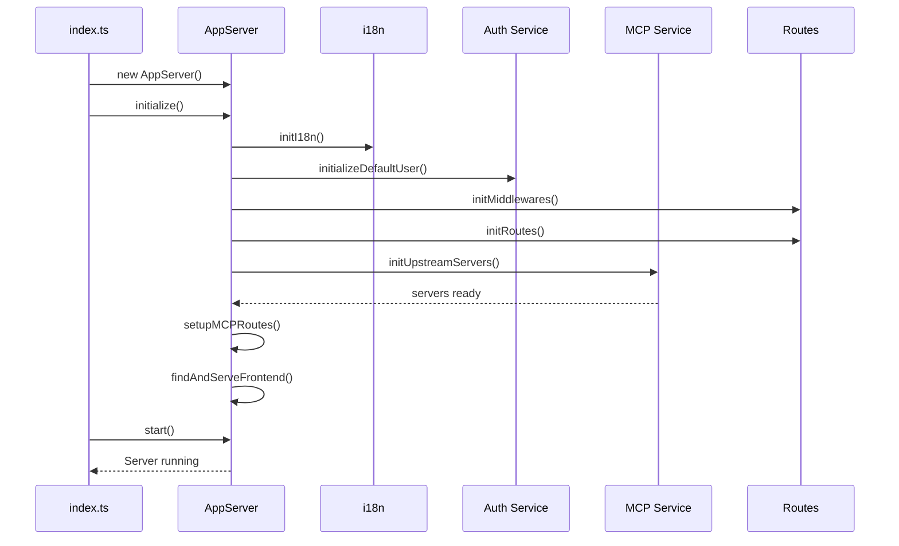
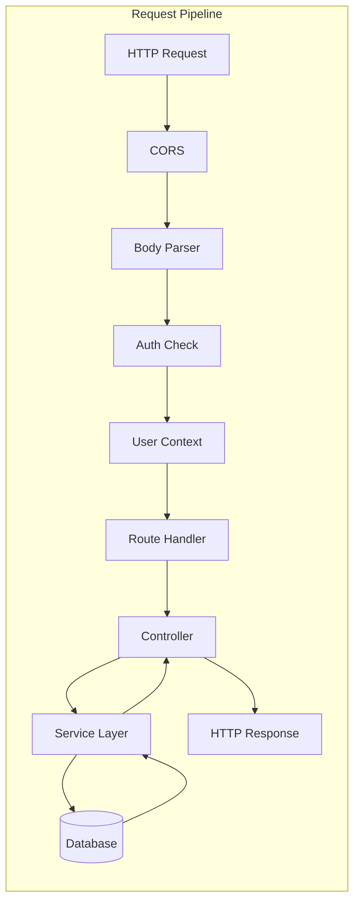
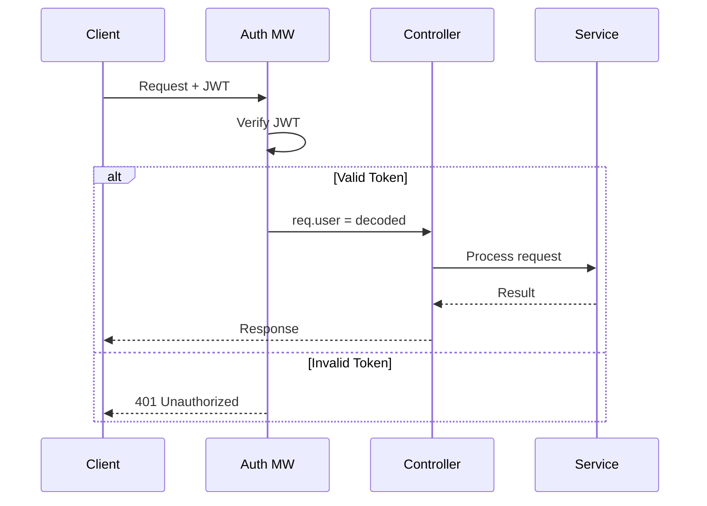

# Backend Architecture

## Express.js Server Implementation Details

The MCPHub backend is built on Node.js with Express.js, utilizing TypeScript for type safety and modern JavaScript features. This document details the server architecture, component organization, and implementation patterns.

## 🏗️ Directory Structure

```
src/
├── index.ts                 # Application entry point
├── server.ts               # Express server initialization
├── config/                 # Configuration management
│   └── index.ts           # Config loader and env handling
├── routes/                 # API route definitions
│   └── index.ts           # Route registration
├── controllers/            # Request handlers
│   ├── authController.ts   # Authentication endpoints
│   ├── serverController.ts # MCP server management
│   ├── groupController.ts  # Group management
│   ├── userController.ts   # User management
│   ├── toolController.ts   # Tool execution
│   └── ...
├── services/              # Business logic layer
│   ├── registry.ts        # Service registry pattern
│   ├── mcpService.ts      # MCP server management
│   ├── sseService.ts      # SSE/HTTP streaming
│   ├── groupService.ts    # Group operations
│   ├── vectorSearchService.ts # AI search
│   └── ...
├── middlewares/           # Express middlewares
│   ├── auth.ts           # JWT authentication
│   ├── userContext.ts    # User context injection
│   └── i18n.ts          # Internationalization
├── models/               # Data models
│   └── User.ts          # User model
├── db/                   # Database layer
│   ├── connection.ts     # Database connection
│   ├── entities/         # TypeORM entities
│   └── repositories/     # Data access layer
├── types/                # TypeScript definitions
│   └── index.ts         # Type declarations
└── utils/               # Utility functions
    ├── path.ts          # Path resolution
    ├── smartRouting.ts  # AI routing logic
    └── ...
```

## 🚀 Server Initialization Flow



### Key Initialization Steps

1. **i18n Initialization**: Load language files and setup translation system
2. **Default User Creation**: Ensure admin user exists for first-time setup
3. **Middleware Stack**: Configure Express middlewares in correct order
4. **Route Registration**: Set up API and MCP protocol routes
5. **MCP Server Init**: Connect to configured MCP servers
6. **Frontend Serving**: Locate and serve React build files

## 📋 Middleware Pipeline

```typescript
// Middleware execution order
app.use(cors());                    // CORS headers
app.use(express.json());            // JSON body parsing
app.use(i18nMiddleware);            // Language detection
app.use(authMiddleware);            // JWT validation (conditional)
app.use(userContextMiddleware);     // User context injection
app.use('/api', apiRoutes);         // API routes
app.use(errorHandler);              // Error handling
```

### Middleware Details

#### Authentication Middleware
```typescript
// src/middlewares/auth.ts
export const auth = async (req, res, next) => {
  // Skip auth if configured
  if (process.env.SKIP_AUTH === 'true') {
    return next();
  }
  
  // Extract JWT from header
  const token = req.headers.authorization?.split(' ')[1];
  
  // Verify token
  const decoded = jwt.verify(token, JWT_SECRET);
  req.user = decoded;
  
  next();
};
```

#### User Context Middleware
```typescript
// src/middlewares/userContext.ts
export const sseUserContextMiddleware = (req, res, next) => {
  const userContextService = UserContextService.getInstance();
  
  // Extract user from URL or auth
  const username = req.params.user || req.user?.username;
  
  // Set user context for request
  userContextService.setCurrentUser(user);
  
  next();
};
```

## 🎯 Service Layer Architecture

### Service Registry Pattern

The service registry enables dependency injection and service customization:

```typescript
// Service registration
registerService('mcpService', {
  defaultImpl: McpService,
  override: McpServiceCustom  // Optional override
});

// Service retrieval
const mcpService = getService<McpService>('mcpService');
```

### Core Services

#### 1. MCP Service (mcpService.ts)
Manages MCP server lifecycle and communication:

```typescript
class McpService {
  // Server management
  initUpstreamServers(): Promise<void>
  getMcpServer(sessionId: string, group?: string): Server
  deleteMcpServer(sessionId: string): void
  
  // Tool management
  notifyToolChanged(): Promise<void>
  syncToolEmbedding(server: string, tool: string): Promise<void>
  
  // Connection handling
  createTransportFromConfig(name: string, config: ServerConfig): Transport
  setupKeepAlive(serverInfo: ServerInfo, config: ServerConfig): void
}
```

**Key Responsibilities:**
- Spawn stdio server processes
- Maintain SSE/HTTP connections
- Handle tool discovery and registration
- Manage keep-alive pings

#### 2. SSE Service (sseService.ts)
Handles Server-Sent Events and HTTP streaming:

```typescript
class SseService {
  // Connection management
  handleSseConnection(req: Request, res: Response): Promise<void>
  handleSseMessage(req: Request, res: Response): Promise<void>
  
  // MCP protocol handlers
  handleMcpPostRequest(req: Request, res: Response): Promise<void>
  handleMcpOtherRequest(req: Request, res: Response): Promise<void>
  
  // Session management
  getGroup(sessionId: string): string
  validateBearerAuth(req: Request): boolean
}
```

**Protocol Support:**
- SSE for real-time streaming
- HTTP for request/response
- Session-based routing
- Bearer token validation

#### 3. Group Service (groupService.ts)
Manages server groups and permissions:

```typescript
class GroupService {
  // Group operations
  getGroups(user?: IUser): IGroup[]
  createGroup(group: IGroup, user?: IUser): boolean
  updateGroup(id: string, updates: Partial<IGroup>): boolean
  
  // Server management
  getServersInGroup(groupId: string): string[]
  getServerConfigInGroup(groupId: string, serverName: string): IGroupServerConfig
  
  // Tool filtering
  filterToolsByGroup(tools: ToolInfo[], config: IGroupServerConfig): ToolInfo[]
}
```

**Features:**
- Hierarchical group structure
- Tool-level permissions
- User-scoped groups
- Dynamic configuration

#### 4. Vector Search Service (vectorSearchService.ts)
AI-powered tool discovery:

```typescript
class VectorSearchService {
  // Embedding management
  saveToolsAsVectorEmbeddings(server: string, tools: ToolInfo[]): Promise<void>
  searchToolsByVector(query: string, threshold?: number): Promise<SearchResult[]>
  
  // Database operations
  createEmbedding(text: string): Promise<number[]>
  findSimilarEmbeddings(vector: number[], limit: number): Promise<VectorEmbedding[]>
}
```

**Capabilities:**
- OpenAI embedding generation
- pgvector similarity search
- Dynamic threshold adjustment
- Result ranking and filtering

## 🔌 Controller Layer

Controllers handle HTTP requests and coordinate services:

### Server Controller
```typescript
// src/controllers/serverController.ts
export const getAllServers = async (req, res) => {
  const user = req.user;
  const settings = loadSettings(user);
  const servers = Object.entries(settings.mcpServers);
  
  // Add runtime status
  const serversWithStatus = servers.map(([name, config]) => ({
    name,
    ...config,
    status: getServerStatus(name)
  }));
  
  res.json(serversWithStatus);
};
```

### Group Controller
```typescript
// src/controllers/groupController.ts
export const createNewGroup = async (req, res) => {
  const { name, description, servers } = req.body;
  const user = req.user;
  
  const group: IGroup = {
    id: uuidv4(),
    name,
    description,
    servers,
    owner: user.username
  };
  
  const success = groupService.createGroup(group, user);
  
  if (success) {
    await notifyToolChanged();
    res.status(201).json(group);
  } else {
    res.status(400).json({ error: 'Failed to create group' });
  }
};
```

## 🔄 Request Processing Flow



## 🔧 MCP Server Process Management

### stdio Server Spawning
```typescript
// Child process creation for stdio servers
const spawnStdioServer = (config: ServerConfig) => {
  const child = spawn(config.command, config.args, {
    env: { ...process.env, ...config.env },
    stdio: ['pipe', 'pipe', 'pipe']
  });
  
  // Create transport
  const transport = new StdioClientTransport({
    command: config.command,
    args: config.args,
    env: config.env
  });
  
  // Initialize client
  const client = new Client({ name: 'mcphub', version: '1.0.0' }, { capabilities: {} });
  
  await client.connect(transport);
  
  return { child, transport, client };
};
```

### Connection Lifecycle
1. **Initialization**: Create transport based on server type
2. **Connection**: Establish connection with retry logic
3. **Tool Discovery**: List available tools from server
4. **Keep-Alive**: Maintain connection health
5. **Cleanup**: Graceful shutdown on disconnect

## 🌐 API Route Structure

```typescript
// Route definitions
router.get('/servers', getAllServers);
router.post('/servers', createServer);
router.put('/servers/:name', updateServer);
router.delete('/servers/:name', deleteServer);

router.get('/groups', getGroups);
router.post('/groups', createNewGroup);
router.put('/groups/:id', updateExistingGroup);
router.delete('/groups/:id', deleteExistingGroup);

router.post('/tools/call/:server', callTool);
```

### Route Categories

1. **Server Management**: CRUD operations for MCP servers
2. **Group Management**: Group creation and membership
3. **User Management**: User CRUD and authentication
4. **Tool Operations**: Tool discovery and execution
5. **System Configuration**: Settings and preferences

## 🔐 Security Implementation

### JWT Token Structure
```typescript
interface JWTPayload {
  username: string;
  isAdmin: boolean;
  iat: number;
  exp: number;
}
```

### Request Authentication Flow


## 🚦 Error Handling

### Error Categories
1. **Validation Errors** (400): Invalid input data
2. **Authentication Errors** (401): Missing or invalid credentials
3. **Authorization Errors** (403): Insufficient permissions
4. **Not Found Errors** (404): Resource doesn't exist
5. **Server Errors** (500): Internal server errors

### Global Error Handler
```typescript
app.use((error, req, res, next) => {
  console.error('Error:', error);
  
  const status = error.status || 500;
  const message = error.message || 'Internal Server Error';
  
  res.status(status).json({
    error: message,
    ...(process.env.NODE_ENV === 'development' && { stack: error.stack })
  });
});
```

## 📊 Performance Optimizations

### Caching Strategy
- **Settings Cache**: In-memory cache for configuration
- **Tool Cache**: Cached tool definitions per server
- **User Cache**: Session-based user data caching

### Connection Pooling
- **Database Connections**: TypeORM connection pool
- **MCP Connections**: Reusable transport instances
- **Process Management**: Limited concurrent processes

### Async Operations
- **Non-blocking I/O**: All database and network operations
- **Promise-based**: Consistent async/await usage
- **Stream Processing**: Efficient large data handling

## 🔄 Hot Reload Support

```typescript
// Watch for configuration changes
fs.watch(settingsPath, async (eventType) => {
  if (eventType === 'change') {
    clearSettingsCache();
    await reloadServers();
    notifyToolChanged();
  }
});
```

## 📚 Related Documentation

- [System Overview](01-system-overview.md) - High-level architecture
- [Service Layer](05-service-layer.md) - Service patterns in detail
- [MCP Protocol](06-mcp-protocol.md) - Protocol implementation
- [API Reference](10-api-reference.md) - Complete API documentation

---

*Next: [Frontend Architecture →](03-frontend-architecture.md)*