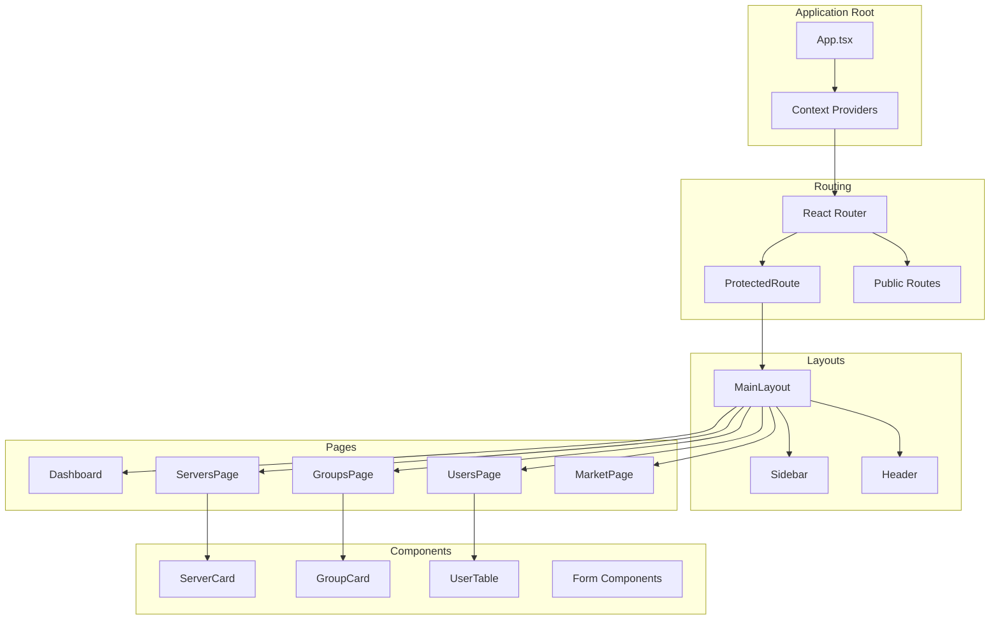

# Frontend Architecture

## React Application Structure and Implementation

The MCPHub frontend is a modern React application built with TypeScript, using Vite as the build tool and Tailwind CSS for styling. It provides a comprehensive dashboard for managing MCP servers, users, and configurations.

## 🏗️ Directory Structure

```
frontend/
├── src/
│   ├── App.tsx                 # Root application component
│   ├── main.tsx               # Application entry point
│   ├── i18n.ts               # Internationalization setup
│   ├── index.css              # Global styles
│   ├── components/            # Reusable UI components
│   │   ├── ui/               # Base UI components (shadcn/ui)
│   │   ├── ProtectedRoute.tsx # Auth route wrapper
│   │   ├── ServerCard.tsx    # Server display component
│   │   ├── GroupCard.tsx     # Group display component
│   │   └── ...
│   ├── contexts/             # React Context providers
│   │   ├── AuthContext.tsx   # Authentication state
│   │   ├── ToastContext.tsx  # Toast notifications
│   │   └── ThemeContext.tsx  # Theme management
│   ├── pages/                # Route components
│   │   ├── LoginPage.tsx     # Authentication
│   │   ├── Dashboard.tsx     # Main dashboard
│   │   ├── ServersPage.tsx   # Server management
│   │   ├── GroupsPage.tsx    # Group management
│   │   ├── UsersPage.tsx     # User administration
│   │   ├── MarketPage.tsx    # Server marketplace
│   │   ├── LogsPage.tsx      # System logs
│   │   └── SettingsPage.tsx  # Configuration
│   ├── layouts/              # Layout components
│   │   └── MainLayout.tsx    # Dashboard layout
│   ├── services/             # API service layer
│   │   ├── api.ts           # API client
│   │   ├── authService.ts   # Authentication API
│   │   └── serverService.ts  # Server management API
│   ├── hooks/                # Custom React hooks
│   │   ├── useAuth.ts       # Authentication hook
│   │   ├── useServers.ts    # Server data hook
│   │   └── useWebSocket.ts  # WebSocket connection
│   ├── types/                # TypeScript definitions
│   │   └── index.ts         # Type declarations
│   ├── utils/                # Utility functions
│   │   ├── runtime.ts       # Runtime configuration
│   │   └── format.ts        # Data formatting
│   └── constants/            # Application constants
│       └── index.ts         # Constants definitions
├── public/                   # Static assets
│   └── locales/             # Translation files
│       ├── en/
│       └── zh/
├── index.html               # HTML template
├── vite.config.ts          # Vite configuration
├── tailwind.config.js      # Tailwind CSS config
└── tsconfig.json           # TypeScript config
```

## 🎯 Component Architecture



## 🎨 UI Component Library

### Base Components (shadcn/ui)
The application uses shadcn/ui components as the foundation:

```typescript
// Example: Button component
import { Button } from '@/components/ui/button';

<Button variant="primary" size="lg" onClick={handleClick}>
  Click Me
</Button>
```

### Component Categories

1. **Layout Components**
   - `MainLayout`: Dashboard wrapper with sidebar
   - `Sidebar`: Navigation menu
   - `Header`: Top bar with user info

2. **Data Display**
   - `ServerCard`: Server status and controls
   - `GroupCard`: Group information and members
   - `Table`: Data tables with sorting/filtering
   - `StatusBadge`: Status indicators

3. **Forms & Input**
   - `Input`: Text input fields
   - `Select`: Dropdown selections
   - `Switch`: Toggle controls
   - `Form`: Form wrapper with validation

4. **Feedback**
   - `Toast`: Notification messages
   - `Dialog`: Modal dialogs
   - `Alert`: Alert messages
   - `Spinner`: Loading indicators

## 🔄 State Management

### Context API Architecture

```typescript
// AuthContext.tsx
interface AuthContextType {
  user: User | null;
  login: (credentials: LoginCredentials) => Promise<void>;
  logout: () => void;
  isAuthenticated: boolean;
  isLoading: boolean;
}

const AuthContext = createContext<AuthContextType | undefined>(undefined);

export const AuthProvider: React.FC = ({ children }) => {
  const [user, setUser] = useState<User | null>(null);
  const [isLoading, setIsLoading] = useState(true);
  
  useEffect(() => {
    // Check for existing session
    const token = localStorage.getItem('token');
    if (token) {
      validateToken(token);
    }
  }, []);
  
  const login = async (credentials: LoginCredentials) => {
    const { user, token } = await authService.login(credentials);
    localStorage.setItem('token', token);
    setUser(user);
  };
  
  return (
    <AuthContext.Provider value={{ user, login, logout, isAuthenticated, isLoading }}>
      {children}
    </AuthContext.Provider>
  );
};
```

### State Management Patterns

1. **Global State** (Context)
   - Authentication state
   - Theme preferences
   - Toast notifications

2. **Local State** (useState)
   - Form inputs
   - UI toggles
   - Modal visibility

3. **Server State** (React Query pattern)
   - API data caching
   - Optimistic updates
   - Background refetching

## 🌍 Internationalization (i18n)

### Setup and Configuration

```typescript
// i18n.ts
import i18n from 'i18next';
import { initReactI18next } from 'react-i18next';
import LanguageDetector from 'i18next-browser-languagedetector';

i18n
  .use(LanguageDetector)
  .use(initReactI18next)
  .init({
    fallbackLng: 'en',
    resources: {
      en: { translation: enTranslations },
      zh: { translation: zhTranslations }
    },
    interpolation: {
      escapeValue: false
    }
  });
```

### Usage in Components

```typescript
import { useTranslation } from 'react-i18next';

const Dashboard: React.FC = () => {
  const { t, i18n } = useTranslation();
  
  return (
    <div>
      <h1>{t('dashboard.title')}</h1>
      <button onClick={() => i18n.changeLanguage('zh')}>
        {t('language.switch')}
      </button>
    </div>
  );
};
```

## 🛣️ Routing Structure

```typescript
// App.tsx routing configuration
<Router basename={getBasePath()}>
  <Routes>
    {/* Public Routes */}
    <Route path="/login" element={<LoginPage />} />
    
    {/* Protected Routes */}
    <Route element={<ProtectedRoute />}>
      <Route element={<MainLayout />}>
        <Route path="/" element={<Dashboard />} />
        <Route path="/servers" element={<ServersPage />} />
        <Route path="/groups" element={<GroupsPage />} />
        <Route path="/users" element={<UsersPage />} />
        <Route path="/market" element={<MarketPage />} />
        <Route path="/market/:serverName" element={<MarketPage />} />
        <Route path="/logs" element={<LogsPage />} />
        <Route path="/settings" element={<SettingsPage />} />
      </Route>
    </Route>
    
    {/* Fallback */}
    <Route path="*" element={<Navigate to="/" />} />
  </Routes>
</Router>
```

### Protected Route Implementation

```typescript
const ProtectedRoute: React.FC = () => {
  const { isAuthenticated, isLoading } = useAuth();
  const location = useLocation();
  
  if (isLoading) {
    return <LoadingScreen />;
  }
  
  if (!isAuthenticated) {
    return <Navigate to="/login" state={{ from: location }} replace />;
  }
  
  return <Outlet />;
};
```

## 🎨 Styling Architecture

### Tailwind CSS Configuration

```javascript
// tailwind.config.js
module.exports = {
  content: ['./src/**/*.{js,jsx,ts,tsx}'],
  theme: {
    extend: {
      colors: {
        primary: {
          50: '#eff6ff',
          500: '#3b82f6',
          900: '#1e3a8a'
        }
      },
      animation: {
        'fade-in': 'fadeIn 0.5s ease-in-out'
      }
    }
  },
  plugins: [
    require('tailwind-scrollbar-hide')
  ]
};
```

### Component Styling Patterns

```typescript
// Using class variance authority for component variants
import { cva } from 'class-variance-authority';

const buttonVariants = cva(
  'inline-flex items-center justify-center rounded-md font-medium transition-colors',
  {
    variants: {
      variant: {
        primary: 'bg-primary-500 text-white hover:bg-primary-600',
        secondary: 'bg-gray-200 text-gray-900 hover:bg-gray-300',
        ghost: 'hover:bg-gray-100'
      },
      size: {
        sm: 'h-8 px-3 text-sm',
        md: 'h-10 px-4',
        lg: 'h-12 px-6 text-lg'
      }
    },
    defaultVariants: {
      variant: 'primary',
      size: 'md'
    }
  }
);
```

## 📡 API Integration

### API Service Layer

```typescript
// services/api.ts
class ApiClient {
  private baseURL: string;
  private token: string | null;
  
  constructor() {
    this.baseURL = import.meta.env.VITE_API_URL || '/api';
    this.token = localStorage.getItem('token');
  }
  
  private async request<T>(
    endpoint: string,
    options: RequestInit = {}
  ): Promise<T> {
    const url = `${this.baseURL}${endpoint}`;
    const config: RequestInit = {
      ...options,
      headers: {
        'Content-Type': 'application/json',
        ...(this.token && { Authorization: `Bearer ${this.token}` }),
        ...options.headers
      }
    };
    
    const response = await fetch(url, config);
    
    if (!response.ok) {
      throw new ApiError(response.status, await response.text());
    }
    
    return response.json();
  }
  
  get<T>(endpoint: string): Promise<T> {
    return this.request<T>(endpoint, { method: 'GET' });
  }
  
  post<T>(endpoint: string, data?: any): Promise<T> {
    return this.request<T>(endpoint, {
      method: 'POST',
      body: JSON.stringify(data)
    });
  }
}
```

### Custom Hooks for Data Fetching

```typescript
// hooks/useServers.ts
export const useServers = () => {
  const [servers, setServers] = useState<Server[]>([]);
  const [loading, setLoading] = useState(true);
  const [error, setError] = useState<Error | null>(null);
  
  useEffect(() => {
    const fetchServers = async () => {
      try {
        setLoading(true);
        const data = await api.get<Server[]>('/servers');
        setServers(data);
      } catch (err) {
        setError(err as Error);
      } finally {
        setLoading(false);
      }
    };
    
    fetchServers();
    
    // Set up polling for real-time updates
    const interval = setInterval(fetchServers, 5000);
    return () => clearInterval(interval);
  }, []);
  
  return { servers, loading, error, refetch: fetchServers };
};
```

## 🎮 Key Features Implementation

### 1. Dashboard Page
```typescript
const Dashboard: React.FC = () => {
  const { servers } = useServers();
  const { groups } = useGroups();
  const { t } = useTranslation();
  
  const stats = {
    totalServers: servers.length,
    activeServers: servers.filter(s => s.status === 'connected').length,
    totalGroups: groups.length,
    totalTools: servers.reduce((acc, s) => acc + s.tools.length, 0)
  };
  
  return (
    <div className="grid grid-cols-1 md:grid-cols-2 lg:grid-cols-4 gap-4">
      <StatCard title={t('dashboard.servers')} value={stats.totalServers} />
      <StatCard title={t('dashboard.active')} value={stats.activeServers} />
      <StatCard title={t('dashboard.groups')} value={stats.totalGroups} />
      <StatCard title={t('dashboard.tools')} value={stats.totalTools} />
    </div>
  );
};
```

### 2. Server Management
```typescript
const ServersPage: React.FC = () => {
  const { servers, loading, error } = useServers();
  const [selectedServer, setSelectedServer] = useState<Server | null>(null);
  
  const handleToggleServer = async (server: Server) => {
    await api.post(`/servers/${server.name}/toggle`);
    refetch();
  };
  
  const handleEditServer = (server: Server) => {
    setSelectedServer(server);
    setEditDialogOpen(true);
  };
  
  return (
    <div className="grid grid-cols-1 md:grid-cols-2 lg:grid-cols-3 gap-4">
      {servers.map(server => (
        <ServerCard
          key={server.name}
          server={server}
          onToggle={() => handleToggleServer(server)}
          onEdit={() => handleEditServer(server)}
        />
      ))}
    </div>
  );
};
```

### 3. Real-time Updates
```typescript
// WebSocket connection for real-time updates
const useWebSocket = (url: string) => {
  const [socket, setSocket] = useState<WebSocket | null>(null);
  const [messages, setMessages] = useState<any[]>([]);
  
  useEffect(() => {
    const ws = new WebSocket(url);
    
    ws.onmessage = (event) => {
      const message = JSON.parse(event.data);
      setMessages(prev => [...prev, message]);
      
      // Handle specific message types
      if (message.type === 'tool-changed') {
        // Refresh tool list
      }
    };
    
    setSocket(ws);
    
    return () => ws.close();
  }, [url]);
  
  return { socket, messages };
};
```

## 🎨 Theme Management

```typescript
// contexts/ThemeContext.tsx
interface ThemeContextType {
  theme: 'light' | 'dark';
  toggleTheme: () => void;
}

export const ThemeProvider: React.FC = ({ children }) => {
  const [theme, setTheme] = useState<'light' | 'dark'>('light');
  
  useEffect(() => {
    const savedTheme = localStorage.getItem('theme') as 'light' | 'dark';
    if (savedTheme) {
      setTheme(savedTheme);
      document.documentElement.classList.toggle('dark', savedTheme === 'dark');
    }
  }, []);
  
  const toggleTheme = () => {
    const newTheme = theme === 'light' ? 'dark' : 'light';
    setTheme(newTheme);
    localStorage.setItem('theme', newTheme);
    document.documentElement.classList.toggle('dark', newTheme === 'dark');
  };
  
  return (
    <ThemeContext.Provider value={{ theme, toggleTheme }}>
      {children}
    </ThemeContext.Provider>
  );
};
```

## 🚀 Build & Optimization

### Vite Configuration
```typescript
// vite.config.ts
import { defineConfig } from 'vite';
import react from '@vitejs/plugin-react';
import path from 'path';

export default defineConfig({
  plugins: [react()],
  resolve: {
    alias: {
      '@': path.resolve(__dirname, './src')
    }
  },
  build: {
    outDir: 'dist',
    sourcemap: true,
    rollupOptions: {
      output: {
        manualChunks: {
          vendor: ['react', 'react-dom', 'react-router-dom'],
          ui: ['@radix-ui/react-accordion', '@radix-ui/react-slot']
        }
      }
    }
  },
  server: {
    proxy: {
      '/api': {
        target: 'http://localhost:3000',
        changeOrigin: true
      }
    }
  }
});
```

### Performance Optimizations

1. **Code Splitting**: Automatic route-based splitting
2. **Lazy Loading**: Dynamic imports for heavy components
3. **Memoization**: React.memo for expensive renders
4. **Virtual Lists**: For large data sets
5. **Image Optimization**: Lazy loading and WebP format

## 📚 Related Documentation

- [System Overview](01-system-overview.md) - Overall architecture
- [Backend Architecture](02-backend-architecture.md) - API integration
- [Authentication](07-authentication.md) - Auth flow details
- [API Reference](10-api-reference.md) - API endpoints

---

*Next: [Data Flow →](04-data-flow.md)*