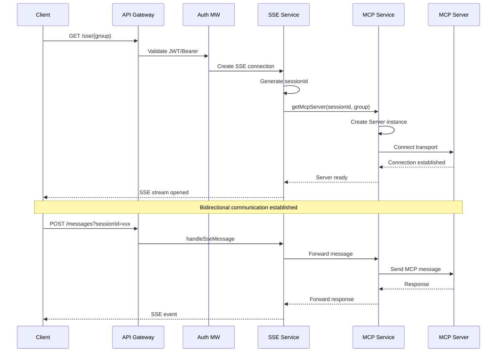
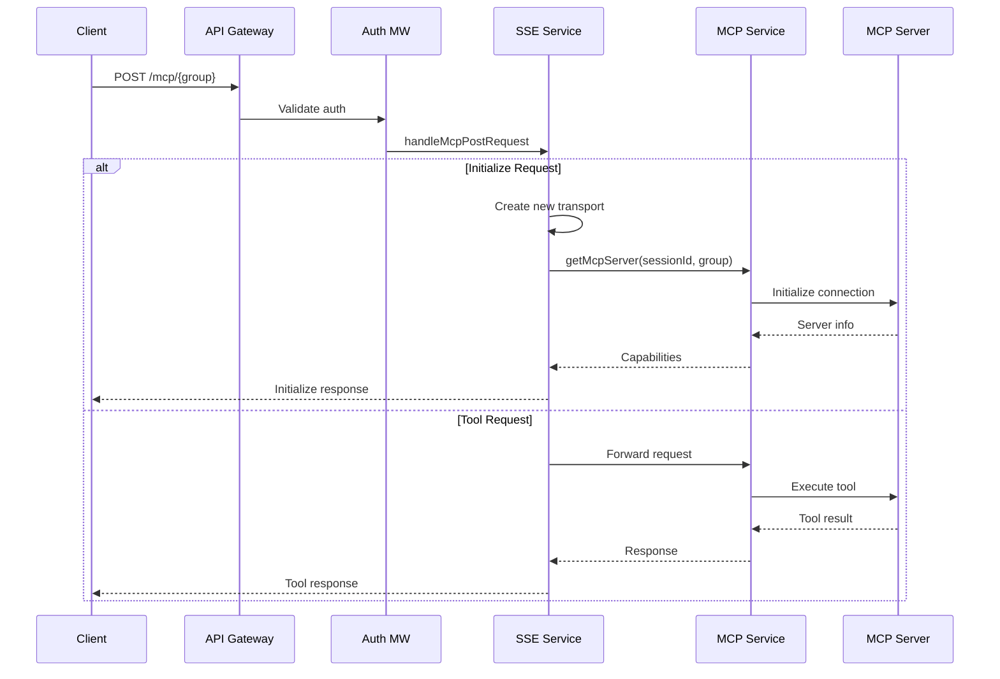
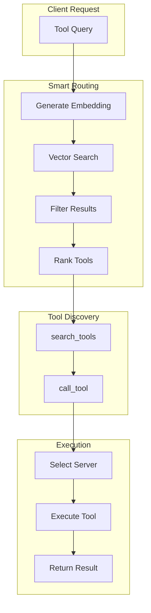
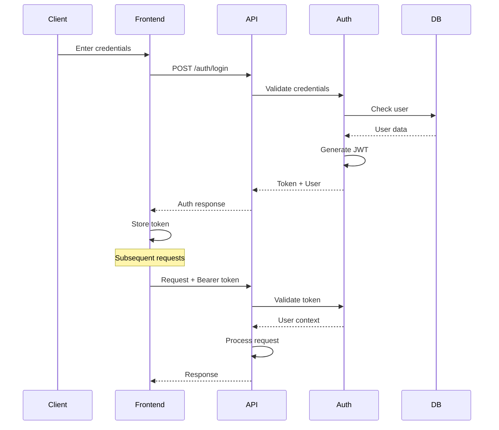
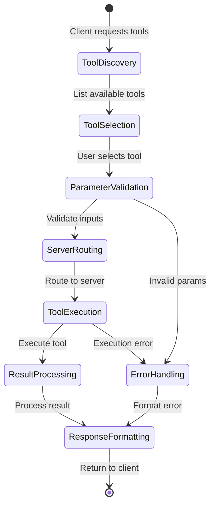
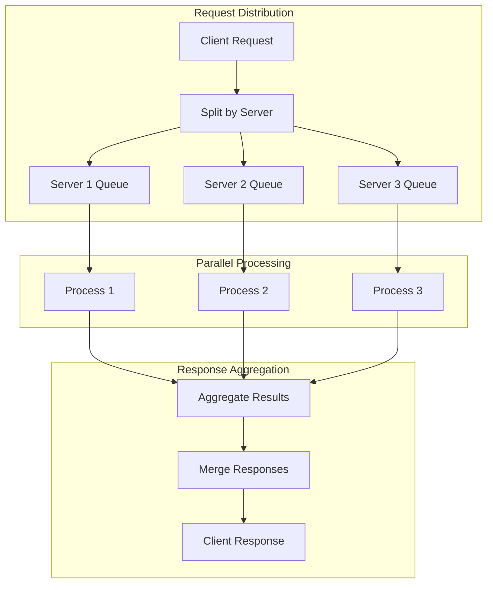
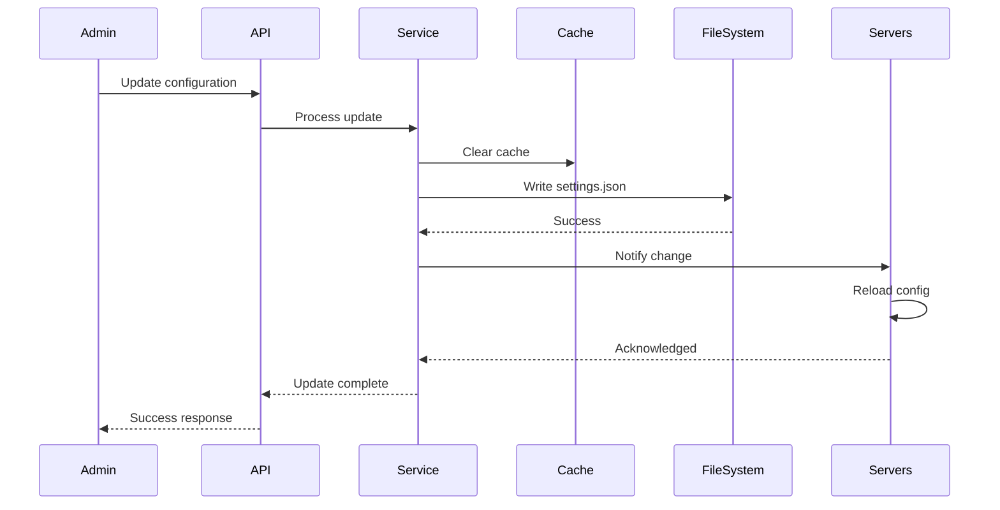
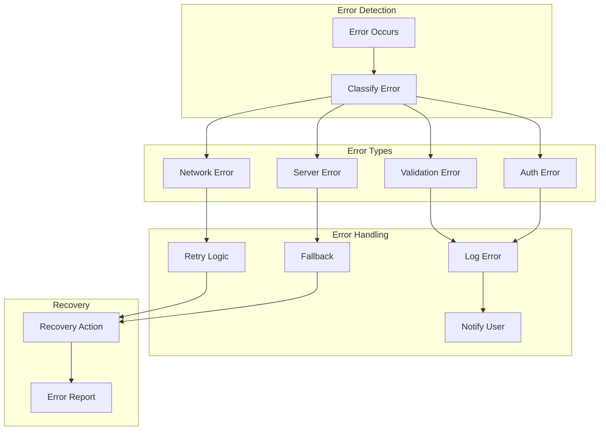
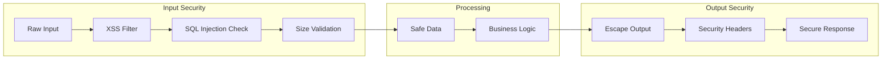

# Data Flow

## Request/Response Flows and Message Routing

This document details how data flows through the MCPHub system, from client requests to MCP server responses, including all intermediate processing steps.

## 🔄 Core Data Flow Patterns

### 1. SSE Connection Flow



### 2. HTTP Streaming Flow



### 3. Smart Routing Flow



## 📨 Message Formats

### MCP Protocol Messages

#### Initialize Request
```json
{
  "jsonrpc": "2.0",
  "id": 1,
  "method": "initialize",
  "params": {
    "protocolVersion": "0.1.0",
    "capabilities": {
      "tools": {}
    },
    "clientInfo": {
      "name": "mcphub",
      "version": "1.0.0"
    }
  }
}
```

#### Tool List Request
```json
{
  "jsonrpc": "2.0",
  "id": 2,
  "method": "tools/list",
  "params": {}
}
```

#### Tool Execution Request
```json
{
  "jsonrpc": "2.0",
  "id": 3,
  "method": "tools/call",
  "params": {
    "name": "get_weather",
    "arguments": {
      "location": "San Francisco"
    }
  }
}
```

### API Response Formats

#### Success Response
```json
{
  "success": true,
  "data": {
    // Response data
  },
  "timestamp": "2025-01-06T10:30:00Z"
}
```

#### Error Response
```json
{
  "success": false,
  "error": {
    "code": "AUTH_FAILED",
    "message": "Invalid credentials",
    "details": {}
  },
  "timestamp": "2025-01-06T10:30:00Z"
}
```

## 🎯 Routing Strategies

### 1. Direct Server Routing
```typescript
// Route: /mcp/{serverName}
flowchart LR
    Request --> ServerName
    ServerName --> LoadConfig
    LoadConfig --> ConnectServer
    ConnectServer --> ForwardMessage
    ForwardMessage --> Response
```

### 2. Group-Based Routing
```typescript
// Route: /mcp/{groupId}
flowchart LR
    Request --> GroupId
    GroupId --> ResolveServers
    ResolveServers --> FilterTools
    FilterTools --> RouteToServers
    RouteToServers --> AggregateResponses
    AggregateResponses --> Response
```

### 3. Global Routing
```typescript
// Route: /mcp (no group specified)
flowchart LR
    Request --> AllServers
    AllServers --> CheckPermissions
    CheckPermissions --> BroadcastRequest
    BroadcastRequest --> CollectResponses
    CollectResponses --> Response
```

## 🔐 Authentication Flow



## 🔄 Tool Execution Flow

### Complete Tool Lifecycle



### Tool Discovery Process

```typescript
// 1. List all tools from a group
async function discoverTools(groupId: string) {
  const group = getGroup(groupId);
  const servers = getServersInGroup(group);
  
  const allTools = [];
  for (const server of servers) {
    const tools = await server.listTools();
    const filtered = filterToolsByGroup(tools, group.config);
    allTools.push(...filtered);
  }
  
  return allTools;
}

// 2. Execute a specific tool
async function executeTool(toolName: string, args: any) {
  const server = findServerWithTool(toolName);
  const result = await server.callTool(toolName, args);
  return result;
}
```

## 📊 Data Transformation Pipeline

### Request Processing

```mermaid
graph LR
    subgraph "Input Processing"
        RAW[Raw Request]
        PARSE[Parse JSON]
        VALIDATE[Validate Schema]
        SANITIZE[Sanitize Input]
    end
    
    subgraph "Business Logic"
        AUTH[Authenticate]
        AUTHORIZE[Authorize]
        TRANSFORM[Transform Data]
        EXECUTE[Execute Logic]
    end
    
    subgraph "Output Processing"
        FORMAT[Format Response]
        SERIALIZE[Serialize JSON]
        COMPRESS[Compress]
        SEND[Send Response]
    end
    
    RAW --> PARSE
    PARSE --> VALIDATE
    VALIDATE --> SANITIZE
    SANITIZE --> AUTH
    AUTH --> AUTHORIZE
    AUTHORIZE --> TRANSFORM
    TRANSFORM --> EXECUTE
    EXECUTE --> FORMAT
    FORMAT --> SERIALIZE
    SERIALIZE --> COMPRESS
    COMPRESS --> SEND
```



## 🌊 Streaming Data Flow

### SSE Event Stream

```typescript
// Server-Sent Events format
data: {"type":"tool-list","tools":[...]}\n\n
data: {"type":"tool-result","result":{...}}\n\n
data: {"type":"error","error":"..."}\n\n
event: ping\ndata: keep-alive\n\n
```

### Chunked Response Handling

```typescript
class StreamProcessor {
  private buffer: string = '';
  
  processChunk(chunk: string) {
    this.buffer += chunk;
    
    // Look for complete messages
    const messages = this.buffer.split('\n\n');
    this.buffer = messages.pop() || '';
    
    for (const message of messages) {
      if (message.startsWith('data: ')) {
        const data = JSON.parse(message.slice(6));
        this.handleMessage(data);
      }
    }
  }
  
  handleMessage(data: any) {
    switch(data.type) {
      case 'tool-list':
        this.updateToolList(data.tools);
        break;
      case 'tool-result':
        this.displayResult(data.result);
        break;
      case 'error':
        this.handleError(data.error);
        break;
    }
  }
}
```

## 🔀 Concurrent Request Handling

### Parallel Tool Execution



## 💾 Data Persistence Flow

### Configuration Updates



## 🔍 Smart Routing Data Flow

### Vector Search Pipeline

```typescript
// 1. Query embedding generation
async function processQuery(query: string) {
  const embedding = await openai.createEmbedding(query);
  return embedding.vector;
}

// 2. Database search
async function searchTools(vector: number[]) {
  const sql = `
    SELECT tool_name, server_name, description,
           1 - (embedding <=> $1) as similarity
    FROM vector_embeddings
    WHERE 1 - (embedding <=> $1) > $2
    ORDER BY similarity DESC
    LIMIT $3
  `;
  
  return db.query(sql, [vector, threshold, limit]);
}

// 3. Result processing
function processResults(results: SearchResult[]) {
  return results.map(r => ({
    tool: r.tool_name,
    server: r.server_name,
    confidence: r.similarity,
    description: r.description
  }));
}
```

## 🚦 Error Handling Flow



## 📈 Performance Monitoring Flow

### Metrics Collection

```typescript
interface RequestMetrics {
  timestamp: Date;
  endpoint: string;
  method: string;
  duration: number;
  statusCode: number;
  userId?: string;
  serverName?: string;
  toolName?: string;
}

class MetricsCollector {
  private metrics: RequestMetrics[] = [];
  
  startTimer(requestId: string) {
    this.timers[requestId] = Date.now();
  }
  
  endTimer(requestId: string, metadata: Partial<RequestMetrics>) {
    const duration = Date.now() - this.timers[requestId];
    
    this.metrics.push({
      timestamp: new Date(),
      duration,
      ...metadata
    });
    
    // Send to monitoring service
    this.sendMetrics();
  }
  
  async sendMetrics() {
    if (this.metrics.length > 100) {
      await monitoring.send(this.metrics);
      this.metrics = [];
    }
  }
}
```

## 🔒 Security Data Flow

### Request Sanitization Pipeline



## 📚 Related Documentation

- [Backend Architecture](02-backend-architecture.md) - Server implementation
- [Service Layer](05-service-layer.md) - Service patterns
- [MCP Protocol](06-mcp-protocol.md) - Protocol details
- [Smart Routing](08-smart-routing.md) - AI routing system

---

*Next: [Service Layer →](05-service-layer.md)*