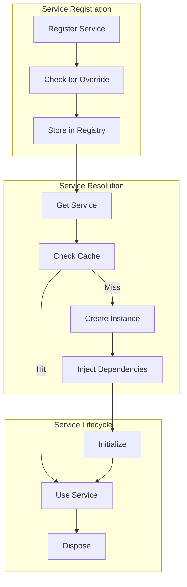
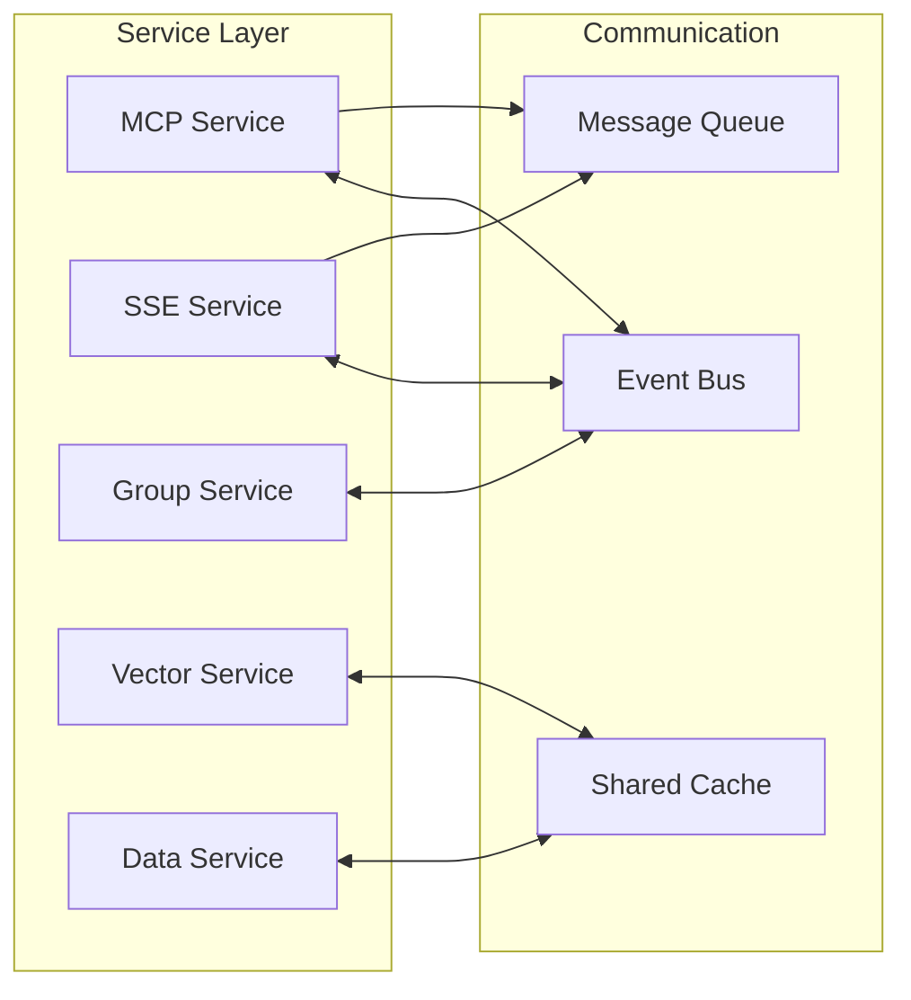

# Service Layer

## Service Registry Pattern and Dependency Injection

The service layer in MCPHub implements a sophisticated service registry pattern that enables dependency injection, runtime service replacement, and plugin-style extensibility.

## 🎯 Service Registry Architecture

### Core Concepts

```typescript
// Service Registry Pattern
interface Service<T> {
  defaultImpl: Class<T>;    // Default implementation
  override?: Class<T>;       // Optional override implementation
}

const registry = new Map<string, Service<any>>();
const instances = new Map<string, unknown>();
```

### Service Registration Flow



## 📦 Service Registration

### Basic Registration

```typescript
// src/services/registry.ts
export function registerService<T>(key: string, entry: Service<T>) {
  // Try to load override from file system
  const overridePath = findOverride(key);
  if (overridePath) {
    entry.override = loadOverride(overridePath);
  }
  
  registry.set(key, entry);
  console.log(`Service registered: ${key}`);
}

// Usage
registerService('mcpService', {
  defaultImpl: McpService,
  override: McpServiceCustom  // Optional
});
```

### Override Discovery

The system automatically discovers service overrides using a naming convention:

```typescript
// Override file naming: {serviceName}x.ts
// Example: mcpServicex.ts for mcpService

function findOverride(serviceName: string) {
  const overrideFileName = serviceName + 'x';
  const searchPaths = [
    'src/services',
    'dist/services'
  ];
  const extensions = ['.ts', '.js'];
  
  for (const dir of searchPaths) {
    for (const ext of extensions) {
      const path = join(dir, overrideFileName + ext);
      if (exists(path)) {
        return path;
      }
    }
  }
  
  return null;
}
```

## 🔧 Service Resolution

### Singleton Pattern

```typescript
export function getService<T>(key: string): T {
  // Check if instance already exists
  if (instances.has(key)) {
    return instances.get(key) as T;
  }
  
  // Get service definition
  const entry = registry.get(key);
  if (!entry) {
    throw new Error(`Service not registered: ${key}`);
  }
  
  // Use override if available, otherwise default
  const Implementation = entry.override || entry.defaultImpl;
  
  // Create and cache instance
  const instance = new Implementation();
  instances.set(key, instance);
  
  return instance;
}
```

### Dependency Injection

```typescript
// Service with dependencies
class UserService {
  private authService: AuthService;
  private dataService: DataService;
  
  constructor() {
    // Inject dependencies via registry
    this.authService = getService<AuthService>('authService');
    this.dataService = getService<DataService>('dataService');
  }
}
```

## 🎨 Core Services

### 1. MCP Service

**Purpose**: Manages MCP server lifecycle and communication

```typescript
interface IMcpService {
  // Server management
  initUpstreamServers(): Promise<void>;
  getMcpServer(sessionId?: string, group?: string): Server;
  deleteMcpServer(sessionId: string): void;
  cleanupAllServers(): void;
  
  // Tool management
  notifyToolChanged(): Promise<void>;
  syncToolEmbedding(server: string, tool: string): Promise<void>;
  
  // Connection management
  connected(): boolean;
  getServerByName(name: string): ServerInfo | undefined;
  getServersInGroup(group: string): ServerInfo[];
}
```

**Implementation Details**:
- Spawns child processes for stdio servers
- Maintains persistent connections for SSE/HTTP
- Handles keep-alive pings
- Manages tool discovery and registration

### 2. SSE Service

**Purpose**: Handles Server-Sent Events and HTTP streaming

```typescript
interface ISseService {
  // Connection handling
  handleSseConnection(req: Request, res: Response): Promise<void>;
  handleSseMessage(req: Request, res: Response): Promise<void>;
  
  // MCP protocol handling
  handleMcpPostRequest(req: Request, res: Response): Promise<void>;
  handleMcpOtherRequest(req: Request, res: Response): Promise<void>;
  
  // Session management
  getGroup(sessionId: string): string;
  validateBearerAuth(req: Request): boolean;
}
```

**Features**:
- Session-based routing
- Bearer token validation
- Message streaming
- Protocol translation

### 3. Group Service

**Purpose**: Manages server groups and permissions

```typescript
interface IGroupService {
  // Group CRUD
  getGroups(user?: IUser): IGroup[];
  getGroup(id: string, user?: IUser): IGroup | undefined;
  createGroup(group: IGroup, user?: IUser): boolean;
  updateGroup(id: string, updates: Partial<IGroup>, user?: IUser): boolean;
  deleteGroup(id: string, user?: IUser): boolean;
  
  // Server management
  addServerToGroup(groupId: string, serverName: string): boolean;
  removeServerFromGroup(groupId: string, serverName: string): boolean;
  getServersInGroup(groupId: string): string[];
  
  // Tool filtering
  getServerConfigInGroup(groupId: string, serverName: string): IGroupServerConfig;
  filterToolsByGroup(tools: ToolInfo[], config: IGroupServerConfig): ToolInfo[];
}
```

**Capabilities**:
- Hierarchical group structure
- Tool-level permissions
- User-scoped groups
- Dynamic membership

### 4. Vector Search Service

**Purpose**: AI-powered tool discovery using embeddings

```typescript
interface IVectorSearchService {
  // Embedding management
  saveToolsAsVectorEmbeddings(server: string, tools: ToolInfo[]): Promise<void>;
  deleteToolEmbeddings(server: string, toolName?: string): Promise<void>;
  
  // Search operations
  searchToolsByVector(query: string, options?: SearchOptions): Promise<SearchResult[]>;
  findSimilarTools(toolName: string, limit?: number): Promise<ToolInfo[]>;
  
  // Database operations
  initializeDatabase(): Promise<void>;
  createEmbedding(text: string): Promise<number[]>;
}
```

**Implementation**:
```typescript
class VectorSearchService {
  private openai: OpenAI;
  private db: Database;
  
  async createEmbedding(text: string): Promise<number[]> {
    const response = await this.openai.embeddings.create({
      model: 'text-embedding-3-small',
      input: text,
      dimensions: 1536
    });
    
    return response.data[0].embedding;
  }
  
  async searchToolsByVector(query: string, options?: SearchOptions) {
    const queryVector = await this.createEmbedding(query);
    
    const results = await this.db.query(`
      SELECT tool_name, server_name, description,
             1 - (embedding <=> $1::vector) as similarity
      FROM vector_embeddings
      WHERE 1 - (embedding <=> $1::vector) > $2
      ORDER BY similarity DESC
      LIMIT $3
    `, [queryVector, options?.threshold ?? 0.7, options?.limit ?? 10]);
    
    return results.rows;
  }
}
```

### 5. Data Service

**Purpose**: Multi-tenant data filtering and transformation

```typescript
interface IDataService {
  // Settings management
  filterSettings(settings: McpSettings, user?: IUser): McpSettings;
  mergeSettings(original: McpSettings, updates: McpSettings, user?: IUser): McpSettings;
  
  // User data scoping
  filterServersByUser(servers: ServerConfig[], user: IUser): ServerConfig[];
  filterGroupsByUser(groups: IGroup[], user: IUser): IGroup[];
  
  // Data transformation
  transformServerConfig(config: ServerConfig, user?: IUser): ServerConfig;
  sanitizeUserData(data: any): any;
}
```

**Security Features**:
- User-scoped data isolation
- Permission-based filtering
- Sensitive data masking
- Input sanitization

### 6. User Context Service

**Purpose**: Request-scoped user context management

```typescript
interface IUserContextService {
  // Context management
  setCurrentUser(user: IUser | null): void;
  getCurrentUser(): IUser | null;
  clearContext(): void;
  
  // Permission checking
  hasPermission(permission: string): boolean;
  canAccessServer(serverName: string): boolean;
  canAccessGroup(groupId: string): boolean;
}
```

**Implementation**:
```typescript
class UserContextService {
  private static instance: UserContextService;
  private contextStore = new AsyncLocalStorage<IUser>();
  
  static getInstance(): UserContextService {
    if (!this.instance) {
      this.instance = new UserContextService();
    }
    return this.instance;
  }
  
  setCurrentUser(user: IUser | null): void {
    this.contextStore.enterWith(user);
  }
  
  getCurrentUser(): IUser | null {
    return this.contextStore.getStore() ?? null;
  }
}
```

### 7. Log Service

**Purpose**: Centralized logging and monitoring

```typescript
interface ILogService {
  // Logging
  log(level: LogLevel, message: string, metadata?: any): void;
  error(message: string, error?: Error): void;
  warn(message: string, metadata?: any): void;
  info(message: string, metadata?: any): void;
  debug(message: string, metadata?: any): void;
  
  // Log retrieval
  getLogs(options?: LogQueryOptions): Promise<LogEntry[]>;
  streamLogs(callback: (log: LogEntry) => void): void;
  clearLogs(): Promise<void>;
}
```

## 🔌 Service Extension Pattern

### Creating Custom Services

```typescript
// 1. Define the interface
interface ICustomService {
  doSomething(): Promise<void>;
}

// 2. Create default implementation
class CustomService implements ICustomService {
  async doSomething(): Promise<void> {
    console.log('Default implementation');
  }
}

// 3. Create override (optional)
class CustomServiceX implements ICustomService {
  async doSomething(): Promise<void> {
    console.log('Custom implementation');
  }
}

// 4. Register the service
registerService('customService', {
  defaultImpl: CustomService,
  override: CustomServiceX
});

// 5. Use the service
const service = getService<ICustomService>('customService');
await service.doSomething();
```

### Service Lifecycle Hooks

```typescript
interface ServiceLifecycle {
  onInit?(): Promise<void>;
  onDestroy?(): Promise<void>;
  onConfigChange?(config: any): Promise<void>;
}

class ManagedService implements ServiceLifecycle {
  async onInit(): Promise<void> {
    // Initialize resources
    await this.connectDatabase();
    await this.loadConfiguration();
  }
  
  async onDestroy(): Promise<void> {
    // Cleanup resources
    await this.disconnectDatabase();
    this.clearCache();
  }
  
  async onConfigChange(config: any): Promise<void> {
    // Handle configuration updates
    await this.reloadSettings(config);
  }
}
```

## 🧪 Testing Services

### Mock Service Pattern

```typescript
// Test file
import { mock } from 'jest-mock-extended';

describe('UserController', () => {
  let mockMcpService: MockProxy<IMcpService>;
  
  beforeEach(() => {
    // Create mock
    mockMcpService = mock<IMcpService>();
    
    // Register mock
    registerService('mcpService', {
      defaultImpl: mockMcpService as any
    });
  });
  
  it('should handle server request', async () => {
    // Setup mock behavior
    mockMcpService.getServerByName.mockReturnValue({
      name: 'test-server',
      status: 'connected'
    });
    
    // Test code that uses the service
    const result = await controller.getServer('test-server');
    
    // Assertions
    expect(result.status).toBe('connected');
    expect(mockMcpService.getServerByName).toHaveBeenCalledWith('test-server');
  });
});
```

## 🔄 Service Communication

### Inter-Service Communication



### Event-Driven Pattern

```typescript
class EventBus {
  private events = new Map<string, Set<EventHandler>>();
  
  on(event: string, handler: EventHandler): void {
    if (!this.events.has(event)) {
      this.events.set(event, new Set());
    }
    this.events.get(event)!.add(handler);
  }
  
  emit(event: string, data?: any): void {
    const handlers = this.events.get(event);
    if (handlers) {
      handlers.forEach(handler => handler(data));
    }
  }
}

// Usage in services
class McpService {
  constructor(private eventBus: EventBus) {
    this.eventBus.on('config-changed', this.handleConfigChange);
  }
  
  async updateServer(name: string, config: ServerConfig) {
    // Update logic
    await this.saveConfig(name, config);
    
    // Notify other services
    this.eventBus.emit('server-updated', { name, config });
  }
}
```

## 🚀 Performance Optimization

### Service Caching

```typescript
class CachedService {
  private cache = new Map<string, CacheEntry>();
  private ttl = 60000; // 1 minute
  
  async getData(key: string): Promise<any> {
    // Check cache
    const cached = this.cache.get(key);
    if (cached && Date.now() - cached.timestamp < this.ttl) {
      return cached.data;
    }
    
    // Fetch fresh data
    const data = await this.fetchData(key);
    
    // Update cache
    this.cache.set(key, {
      data,
      timestamp: Date.now()
    });
    
    return data;
  }
}
```

### Lazy Loading

```typescript
class LazyService {
  private initialized = false;
  
  async ensureInitialized(): Promise<void> {
    if (!this.initialized) {
      await this.initialize();
      this.initialized = true;
    }
  }
  
  async doWork(): Promise<void> {
    await this.ensureInitialized();
    // Actual work
  }
}
```

## 📊 Service Monitoring

### Health Checks

```typescript
interface HealthCheck {
  name: string;
  status: 'healthy' | 'unhealthy' | 'degraded';
  message?: string;
  timestamp: Date;
}

class ServiceMonitor {
  async checkHealth(): Promise<HealthCheck[]> {
    const checks: HealthCheck[] = [];
    
    // Check database
    checks.push(await this.checkDatabase());
    
    // Check MCP servers
    checks.push(await this.checkMcpServers());
    
    // Check vector service
    checks.push(await this.checkVectorService());
    
    return checks;
  }
}
```

## 📚 Related Documentation

- [System Overview](01-system-overview.md) - Architecture patterns
- [Backend Architecture](02-backend-architecture.md) - Server implementation
- [Data Flow](04-data-flow.md) - Service interactions
- [MCP Protocol](06-mcp-protocol.md) - Protocol service details

---

*Next: [MCP Protocol →](06-mcp-protocol.md)*