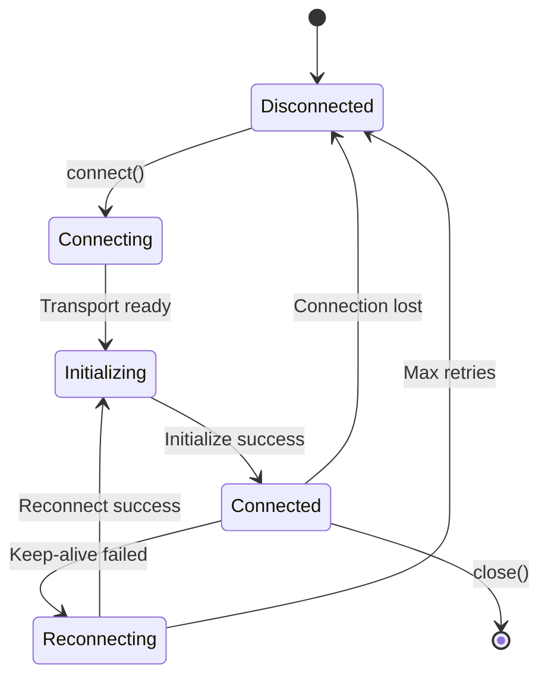

# MCP Protocol Implementation

## Model Context Protocol Integration and Transport Handling

MCPHub implements the Model Context Protocol (MCP) specification, providing a unified interface for AI models to interact with various tools and services through multiple transport mechanisms.

## 🎯 Protocol Overview

The Model Context Protocol (MCP) is a standardized protocol for communication between AI models and external tools. MCPHub acts as a hub that:

1. **Manages multiple MCP servers** with different transport types
2. **Provides protocol translation** between different transport mechanisms
3. **Handles tool discovery** and execution
4. **Maintains connection lifecycle** for all server types

## 🔌 Transport Types

### 1. stdio Transport

**Use Case**: Local command-line tools and scripts

```typescript
// Configuration
{
  "type": "stdio",
  "command": "python",
  "args": ["mcp_server.py"],
  "env": {
    "API_KEY": "xxx"
  }
}

// Implementation
class StdioTransport {
  private process: ChildProcess;
  
  async connect() {
    this.process = spawn(this.command, this.args, {
      env: { ...process.env, ...this.env },
      stdio: ['pipe', 'pipe', 'pipe']
    });
    
    // Setup message handlers
    this.process.stdout.on('data', this.handleMessage);
    this.process.stderr.on('data', this.handleError);
  }
  
  async send(message: any) {
    this.process.stdin.write(JSON.stringify(message) + '\n');
  }
}
```

### 2. SSE Transport

**Use Case**: Real-time streaming connections

```typescript
// Configuration
{
  "type": "sse",
  "url": "http://localhost:8080/sse",
  "headers": {
    "Authorization": "Bearer token"
  }
}

// Implementation
class SSETransport {
  private eventSource: EventSource;
  
  async connect() {
    this.eventSource = new EventSource(this.url);
    
    this.eventSource.onmessage = (event) => {
      const message = JSON.parse(event.data);
      this.handleMessage(message);
    };
    
    this.eventSource.onerror = (error) => {
      this.handleError(error);
      this.reconnect();
    };
  }
  
  async send(message: any) {
    await fetch(this.url + '/messages', {
      method: 'POST',
      headers: this.headers,
      body: JSON.stringify(message)
    });
  }
}
```

### 3. HTTP Streaming Transport

**Use Case**: RESTful API integration

```typescript
// Configuration
{
  "type": "streamable-http",
  "url": "http://api.example.com/mcp",
  "headers": {
    "API-Key": "xxx"
  }
}

// Implementation
class HTTPTransport {
  async connect() {
    // HTTP doesn't maintain persistent connection
    // Initialize by sending initialize request
    const response = await this.request('initialize', {
      protocolVersion: '0.1.0',
      capabilities: {}
    });
  }
  
  async send(message: any) {
    const response = await fetch(this.url, {
      method: 'POST',
      headers: {
        'Content-Type': 'application/json',
        ...this.headers
      },
      body: JSON.stringify(message)
    });
    
    return response.json();
  }
}
```

### 4. OpenAPI Transport

**Use Case**: Auto-discovery from OpenAPI specifications

```typescript
// Configuration
{
  "type": "openapi",
  "openapi": {
    "url": "https://api.example.com/openapi.json",
    "security": {
      "type": "apiKey",
      "apiKey": {
        "name": "X-API-Key",
        "in": "header",
        "value": "xxx"
      }
    }
  }
}

// Implementation
class OpenAPITransport {
  private spec: OpenAPISpec;
  private tools: Map<string, ToolDefinition>;
  
  async connect() {
    // Fetch and parse OpenAPI spec
    this.spec = await this.fetchSpec();
    
    // Convert endpoints to MCP tools
    this.tools = this.convertToTools(this.spec);
  }
  
  convertToTools(spec: OpenAPISpec): Map<string, ToolDefinition> {
    const tools = new Map();
    
    for (const [path, methods] of Object.entries(spec.paths)) {
      for (const [method, operation] of Object.entries(methods)) {
        const tool = {
          name: operation.operationId,
          description: operation.summary,
          inputSchema: this.extractSchema(operation),
          handler: this.createHandler(path, method)
        };
        
        tools.set(tool.name, tool);
      }
    }
    
    return tools;
  }
}
```

## 📋 Message Format

### JSON-RPC 2.0 Structure

All MCP messages follow the JSON-RPC 2.0 specification:

```typescript
interface JsonRpcRequest {
  jsonrpc: "2.0";
  id: string | number;
  method: string;
  params?: any;
}

interface JsonRpcResponse {
  jsonrpc: "2.0";
  id: string | number;
  result?: any;
  error?: {
    code: number;
    message: string;
    data?: any;
  };
}
```

### Protocol Messages

#### Initialize
```json
{
  "jsonrpc": "2.0",
  "id": 1,
  "method": "initialize",
  "params": {
    "protocolVersion": "0.1.0",
    "capabilities": {
      "tools": {},
      "prompts": {},
      "resources": {}
    },
    "clientInfo": {
      "name": "mcphub",
      "version": "1.0.0"
    }
  }
}
```

#### List Tools
```json
{
  "jsonrpc": "2.0",
  "id": 2,
  "method": "tools/list",
  "params": {}
}
```

#### Call Tool
```json
{
  "jsonrpc": "2.0",
  "id": 3,
  "method": "tools/call",
  "params": {
    "name": "get_weather",
    "arguments": {
      "location": "New York",
      "units": "celsius"
    }
  }
}
```

## 🔄 Connection Lifecycle



### Connection Management

```typescript
class McpConnection {
  private status: ConnectionStatus = 'disconnected';
  private retryCount = 0;
  private maxRetries = 3;
  
  async connect() {
    try {
      this.status = 'connecting';
      await this.transport.connect();
      
      this.status = 'initializing';
      await this.initialize();
      
      this.status = 'connected';
      this.setupKeepAlive();
      this.retryCount = 0;
      
    } catch (error) {
      await this.handleConnectionError(error);
    }
  }
  
  async handleConnectionError(error: Error) {
    if (this.retryCount < this.maxRetries) {
      this.status = 'reconnecting';
      this.retryCount++;
      
      // Exponential backoff
      const delay = Math.pow(2, this.retryCount) * 1000;
      await sleep(delay);
      
      return this.connect();
    }
    
    this.status = 'disconnected';
    throw error;
  }
}
```

## 🛠️ Tool Management

### Tool Discovery

```typescript
class ToolManager {
  private tools = new Map<string, ToolInfo>();
  
  async discoverTools(server: McpServer) {
    const response = await server.request('tools/list');
    
    for (const tool of response.tools) {
      this.tools.set(`${server.name}:${tool.name}`, {
        ...tool,
        server: server.name,
        fullName: `${server.name}:${tool.name}`
      });
    }
    
    // Save to vector embeddings for smart routing
    if (config.smartRouting.enabled) {
      await this.saveToolEmbeddings(response.tools);
    }
  }
}
```

### Tool Execution

```typescript
async function executeTool(
  toolName: string,
  arguments: any,
  serverName?: string
): Promise<any> {
  // Find the server that has this tool
  const server = serverName 
    ? getServerByName(serverName)
    : findServerWithTool(toolName);
    
  if (!server) {
    throw new Error(`Tool not found: ${toolName}`);
  }
  
  // Validate arguments against schema
  const tool = server.tools.find(t => t.name === toolName);
  validateArguments(arguments, tool.inputSchema);
  
  // Execute the tool
  const response = await server.request('tools/call', {
    name: toolName,
    arguments
  });
  
  // Handle response
  if (response.error) {
    throw new McpError(response.error);
  }
  
  return response.result;
}
```

## 🔧 Protocol Extensions

### Custom Capabilities

MCPHub extends the base MCP protocol with custom capabilities:

```typescript
interface McpHubCapabilities extends McpCapabilities {
  // Standard MCP capabilities
  tools: ToolsCapability;
  prompts: PromptsCapability;
  resources: ResourcesCapability;
  
  // MCPHub extensions
  streaming: {
    supported: boolean;
    protocols: ['sse', 'websocket'];
  };
  grouping: {
    supported: boolean;
    maxGroupSize: number;
  };
  smartRouting: {
    supported: boolean;
    model: string;
  };
}
```

### Protocol Negotiation

```typescript
async function negotiateProtocol(
  client: ClientInfo,
  server: ServerInfo
): Promise<NegotiatedProtocol> {
  // Find common protocol version
  const protocolVersion = findCommonVersion(
    client.supportedVersions,
    server.supportedVersions
  );
  
  // Merge capabilities
  const capabilities = mergeCapabilities(
    client.capabilities,
    server.capabilities
  );
  
  return {
    version: protocolVersion,
    capabilities,
    extensions: determineExtensions(client, server)
  };
}
```

## 📡 Keep-Alive Mechanism

### Implementation

```typescript
class KeepAliveManager {
  private intervals = new Map<string, NodeJS.Timer>();
  
  setupKeepAlive(
    serverInfo: ServerInfo,
    config: ServerConfig
  ): void {
    // Only for persistent connections
    if (!this.requiresKeepAlive(serverInfo.transport)) {
      return;
    }
    
    const interval = config.keepAliveInterval || 60000;
    
    const timer = setInterval(async () => {
      try {
        await serverInfo.client.ping();
        console.log(`Keep-alive successful: ${serverInfo.name}`);
      } catch (error) {
        console.error(`Keep-alive failed: ${serverInfo.name}`);
        await this.handleKeepAliveFailure(serverInfo);
      }
    }, interval);
    
    this.intervals.set(serverInfo.name, timer);
  }
  
  private requiresKeepAlive(transport: Transport): boolean {
    return transport instanceof SSEClientTransport ||
           transport instanceof WebSocketTransport;
  }
}
```

## 🔒 Security Considerations

### Transport Security

```typescript
class SecureTransport {
  // TLS/SSL for HTTP connections
  validateCertificate(cert: Certificate): boolean {
    return cert.isValid() && 
           cert.notExpired() &&
           this.trustedCA.includes(cert.issuer);
  }
  
  // Authentication headers
  addAuthentication(headers: Headers): Headers {
    return {
      ...headers,
      'Authorization': `Bearer ${this.token}`,
      'X-API-Key': this.apiKey,
      'X-Request-ID': generateRequestId()
    };
  }
  
  // Input validation
  validateMessage(message: any): boolean {
    return this.validateSchema(message) &&
           this.validateSize(message) &&
           this.sanitizeInput(message);
  }
}
```

## 📊 Protocol Monitoring

### Metrics Collection

```typescript
interface ProtocolMetrics {
  messagesReceived: number;
  messagesSent: number;
  toolsExecuted: number;
  errors: number;
  averageLatency: number;
  connectionUptime: number;
}

class ProtocolMonitor {
  private metrics = new Map<string, ProtocolMetrics>();
  
  recordMessage(server: string, direction: 'in' | 'out') {
    const m = this.getMetrics(server);
    if (direction === 'in') {
      m.messagesReceived++;
    } else {
      m.messagesSent++;
    }
  }
  
  recordToolExecution(server: string, duration: number) {
    const m = this.getMetrics(server);
    m.toolsExecuted++;
    m.averageLatency = 
      (m.averageLatency * (m.toolsExecuted - 1) + duration) / 
      m.toolsExecuted;
  }
}
```

## 🔄 Error Handling

### Protocol Errors

```typescript
enum McpErrorCode {
  ParseError = -32700,
  InvalidRequest = -32600,
  MethodNotFound = -32601,
  InvalidParams = -32602,
  InternalError = -32603,
  
  // Custom errors
  TransportError = -32000,
  AuthenticationError = -32001,
  ToolExecutionError = -32002,
  TimeoutError = -32003
}

class McpError extends Error {
  constructor(
    public code: McpErrorCode,
    message: string,
    public data?: any
  ) {
    super(message);
  }
  
  toJsonRpc() {
    return {
      code: this.code,
      message: this.message,
      data: this.data
    };
  }
}
```

## 📚 Related Documentation

- [System Overview](01-system-overview.md) - Architecture patterns
- [Backend Architecture](02-backend-architecture.md) - Server implementation
- [Service Layer](05-service-layer.md) - Service architecture
- [Data Flow](04-data-flow.md) - Message routing

---

*Next: [Authentication →](07-authentication.md)*