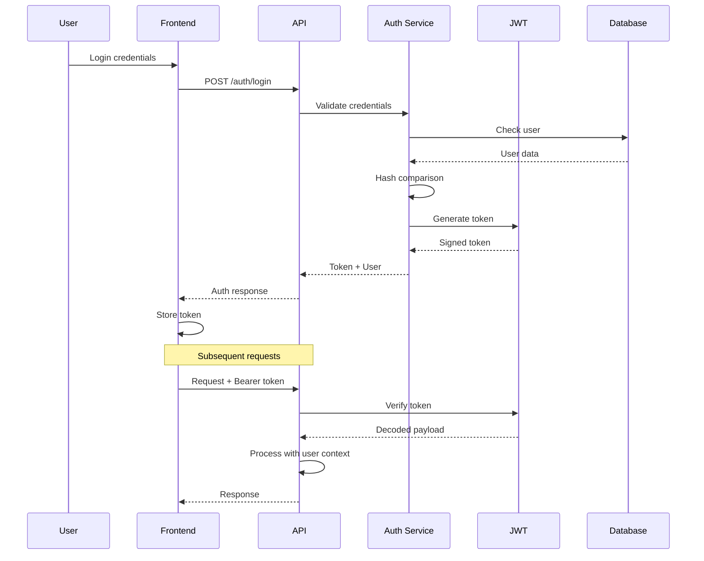

# Authentication & Security

## JWT Authentication, Access Control, and Security Implementation

MCPHub implements a comprehensive security system with JWT-based authentication, role-based access control, and multi-tenant data isolation.

## 🔐 Authentication Architecture



## 🎯 Security Layers

### 1. Network Security
- **HTTPS/TLS**: Encrypted communication
- **CORS**: Cross-origin resource sharing controls
- **Rate Limiting**: API request throttling
- **IP Whitelisting**: Optional IP-based access control

### 2. Authentication Layer
- **JWT Tokens**: Stateless authentication
- **Bearer Tokens**: API key authentication
- **Session Management**: Token lifecycle control
- **Multi-factor**: Optional 2FA support

### 3. Authorization Layer
- **Role-Based Access**: Admin/User roles
- **Resource Permissions**: Fine-grained access control
- **Group Ownership**: User-owned resources
- **API Scopes**: Limited token permissions

### 4. Data Security
- **Password Hashing**: bcrypt with salt
- **Input Validation**: Schema validation
- **SQL Injection Prevention**: Parameterized queries
- **XSS Protection**: Content sanitization

## 🔑 JWT Implementation

### Token Structure

```typescript
interface JWTPayload {
  // Standard claims
  sub: string;        // Subject (user ID)
  iat: number;        // Issued at
  exp: number;        // Expiration
  
  // Custom claims
  username: string;
  isAdmin: boolean;
  permissions?: string[];
}

// Example token payload
{
  "sub": "user-123",
  "username": "john.doe",
  "isAdmin": false,
  "permissions": ["read:servers", "write:groups"],
  "iat": 1704067200,
  "exp": 1704153600
}
```

### Token Generation

```typescript
import jwt from 'jsonwebtoken';
import bcrypt from 'bcryptjs';

class AuthService {
  private readonly JWT_SECRET = process.env.JWT_SECRET || 'default-secret';
  private readonly TOKEN_EXPIRY = '24h';
  private readonly SALT_ROUNDS = 10;
  
  async login(username: string, password: string): Promise<AuthResponse> {
    // Find user
    const user = await this.userRepository.findByUsername(username);
    if (!user) {
      throw new UnauthorizedError('Invalid credentials');
    }
    
    // Verify password
    const isValid = await bcrypt.compare(password, user.passwordHash);
    if (!isValid) {
      throw new UnauthorizedError('Invalid credentials');
    }
    
    // Generate token
    const token = this.generateToken(user);
    
    // Log authentication event
    await this.auditLog.log('auth.login', { username, ip: req.ip });
    
    return {
      token,
      user: this.sanitizeUser(user)
    };
  }
  
  private generateToken(user: User): string {
    const payload: JWTPayload = {
      sub: user.id,
      username: user.username,
      isAdmin: user.isAdmin,
      permissions: this.getUserPermissions(user),
      iat: Math.floor(Date.now() / 1000)
    };
    
    return jwt.sign(payload, this.JWT_SECRET, {
      expiresIn: this.TOKEN_EXPIRY,
      algorithm: 'HS256'
    });
  }
}
```

### Token Verification

```typescript
export const authMiddleware = async (req: Request, res: Response, next: NextFunction) => {
  try {
    // Skip auth if configured
    if (process.env.SKIP_AUTH === 'true') {
      req.user = { username: 'anonymous', isAdmin: true };
      return next();
    }
    
    // Extract token
    const token = extractToken(req);
    if (!token) {
      return res.status(401).json({ error: 'No token provided' });
    }
    
    // Verify token
    const decoded = jwt.verify(token, JWT_SECRET) as JWTPayload;
    
    // Check expiration
    if (decoded.exp && decoded.exp < Date.now() / 1000) {
      return res.status(401).json({ error: 'Token expired' });
    }
    
    // Attach user to request
    req.user = decoded;
    
    // Set user context for services
    UserContextService.getInstance().setCurrentUser(decoded);
    
    next();
  } catch (error) {
    return res.status(401).json({ error: 'Invalid token' });
  }
};

function extractToken(req: Request): string | null {
  // Check Authorization header
  const authHeader = req.headers.authorization;
  if (authHeader?.startsWith('Bearer ')) {
    return authHeader.substring(7);
  }
  
  // Check query parameter (for SSE)
  if (req.query.token) {
    return req.query.token as string;
  }
  
  // Check cookie
  if (req.cookies?.token) {
    return req.cookies.token;
  }
  
  return null;
}
```

## 🛡️ Password Security

### Password Hashing

```typescript
class PasswordManager {
  private readonly SALT_ROUNDS = 10;
  private readonly MIN_LENGTH = 8;
  private readonly COMPLEXITY_REGEX = /^(?=.*[a-z])(?=.*[A-Z])(?=.*\d)(?=.*[@$!%*?&])/;
  
  async hashPassword(password: string): Promise<string> {
    // Validate password strength
    this.validatePassword(password);
    
    // Generate salt and hash
    const salt = await bcrypt.genSalt(this.SALT_ROUNDS);
    const hash = await bcrypt.hash(password, salt);
    
    return hash;
  }
  
  validatePassword(password: string): void {
    if (password.length < this.MIN_LENGTH) {
      throw new ValidationError('Password must be at least 8 characters');
    }
    
    if (!this.COMPLEXITY_REGEX.test(password)) {
      throw new ValidationError(
        'Password must contain uppercase, lowercase, number, and special character'
      );
    }
    
    // Check against common passwords
    if (this.isCommonPassword(password)) {
      throw new ValidationError('Password is too common');
    }
  }
  
  async verifyPassword(password: string, hash: string): Promise<boolean> {
    return bcrypt.compare(password, hash);
  }
}
```

## 👥 Role-Based Access Control

### Role Definitions

```typescript
enum Role {
  ADMIN = 'admin',
  USER = 'user',
  VIEWER = 'viewer'
}

interface Permission {
  resource: string;
  action: string;
  scope?: string;
}

const ROLE_PERMISSIONS: Record<Role, Permission[]> = {
  [Role.ADMIN]: [
    { resource: '*', action: '*' }  // Full access
  ],
  [Role.USER]: [
    { resource: 'servers', action: 'read' },
    { resource: 'servers', action: 'write', scope: 'owned' },
    { resource: 'groups', action: 'read' },
    { resource: 'groups', action: 'write', scope: 'owned' },
    { resource: 'tools', action: 'execute' }
  ],
  [Role.VIEWER]: [
    { resource: 'servers', action: 'read' },
    { resource: 'groups', action: 'read' }
  ]
};
```

### Authorization Middleware

```typescript
export const authorize = (resource: string, action: string) => {
  return (req: Request, res: Response, next: NextFunction) => {
    const user = req.user;
    
    if (!user) {
      return res.status(401).json({ error: 'Not authenticated' });
    }
    
    // Admin bypass
    if (user.isAdmin) {
      return next();
    }
    
    // Check permissions
    const hasPermission = checkPermission(user, resource, action);
    
    if (!hasPermission) {
      return res.status(403).json({ 
        error: 'Insufficient permissions',
        required: `${action}:${resource}`
      });
    }
    
    next();
  };
};

function checkPermission(user: User, resource: string, action: string): boolean {
  const permissions = ROLE_PERMISSIONS[user.role] || [];
  
  return permissions.some(p => {
    const resourceMatch = p.resource === '*' || p.resource === resource;
    const actionMatch = p.action === '*' || p.action === action;
    
    return resourceMatch && actionMatch;
  });
}
```

## 🔐 Bearer Token Authentication

### Implementation

```typescript
interface BearerToken {
  key: string;
  name: string;
  createdAt: Date;
  expiresAt?: Date;
  permissions: string[];
}

class BearerAuthService {
  async createToken(user: User, name: string): Promise<BearerToken> {
    const key = this.generateSecureToken();
    
    const token: BearerToken = {
      key,
      name,
      createdAt: new Date(),
      expiresAt: this.getExpirationDate(),
      permissions: this.getUserPermissions(user)
    };
    
    // Store hashed token
    await this.storeToken(user.id, this.hashToken(key), token);
    
    return token;
  }
  
  private generateSecureToken(): string {
    return crypto.randomBytes(32).toString('hex');
  }
  
  async validateBearerToken(token: string): Promise<User | null> {
    const hashedToken = this.hashToken(token);
    const storedToken = await this.findToken(hashedToken);
    
    if (!storedToken) {
      return null;
    }
    
    // Check expiration
    if (storedToken.expiresAt && storedToken.expiresAt < new Date()) {
      await this.deleteToken(hashedToken);
      return null;
    }
    
    return this.getUserFromToken(storedToken);
  }
}
```

## 🏢 Multi-Tenant Security

### Data Isolation

```typescript
class MultiTenantService {
  // Filter data by user ownership
  filterByOwnership<T extends { owner?: string }>(
    items: T[],
    user: User
  ): T[] {
    if (user.isAdmin) {
      return items; // Admin sees all
    }
    
    return items.filter(item => 
      !item.owner || // Public items
      item.owner === user.username // User's items
    );
  }
  
  // Validate user access to resource
  canAccess(resource: any, user: User): boolean {
    if (user.isAdmin) {
      return true;
    }
    
    if (!resource.owner) {
      return true; // Public resource
    }
    
    return resource.owner === user.username;
  }
  
  // Apply row-level security
  applyRLS(query: QueryBuilder, user: User): QueryBuilder {
    if (!user.isAdmin) {
      query.where('owner = :owner OR owner IS NULL', { 
        owner: user.username 
      });
    }
    
    return query;
  }
}
```

## 🔒 Security Headers

```typescript
export const securityHeaders = (req: Request, res: Response, next: NextFunction) => {
  // Security headers
  res.setHeader('X-Content-Type-Options', 'nosniff');
  res.setHeader('X-Frame-Options', 'DENY');
  res.setHeader('X-XSS-Protection', '1; mode=block');
  res.setHeader('Strict-Transport-Security', 'max-age=31536000; includeSubDomains');
  res.setHeader('Content-Security-Policy', "default-src 'self'");
  res.setHeader('Referrer-Policy', 'strict-origin-when-cross-origin');
  
  // Remove sensitive headers
  res.removeHeader('X-Powered-By');
  
  next();
};
```

## 🚦 Rate Limiting

```typescript
import rateLimit from 'express-rate-limit';

// General API rate limit
export const apiLimiter = rateLimit({
  windowMs: 15 * 60 * 1000, // 15 minutes
  max: 100, // 100 requests per window
  message: 'Too many requests, please try again later',
  standardHeaders: true,
  legacyHeaders: false
});

// Strict limit for auth endpoints
export const authLimiter = rateLimit({
  windowMs: 15 * 60 * 1000, // 15 minutes
  max: 5, // 5 attempts per window
  skipSuccessfulRequests: true,
  message: 'Too many login attempts, please try again later'
});

// Custom rate limit by user role
export const roleLimiter = (req: Request) => {
  const user = req.user;
  
  if (user?.isAdmin) {
    return 1000; // Admin: 1000 requests
  }
  
  if (user) {
    return 100; // Authenticated: 100 requests
  }
  
  return 10; // Anonymous: 10 requests
};
```

## 📝 Audit Logging

```typescript
interface AuditLog {
  timestamp: Date;
  userId?: string;
  username?: string;
  action: string;
  resource?: string;
  ip: string;
  userAgent: string;
  success: boolean;
  details?: any;
}

class AuditService {
  async log(action: string, req: Request, success = true, details?: any) {
    const entry: AuditLog = {
      timestamp: new Date(),
      userId: req.user?.sub,
      username: req.user?.username,
      action,
      resource: req.params.id || req.params.name,
      ip: this.getClientIp(req),
      userAgent: req.headers['user-agent'] || 'unknown',
      success,
      details
    };
    
    // Store in database
    await this.auditRepository.save(entry);
    
    // Alert on suspicious activity
    if (this.isSuspicious(entry)) {
      await this.alertAdmins(entry);
    }
  }
  
  private isSuspicious(entry: AuditLog): boolean {
    // Multiple failed auth attempts
    // Unusual access patterns
    // Privilege escalation attempts
    return false; // Implementation depends on requirements
  }
}
```

## 🛡️ Input Validation

```typescript
import { body, validationResult } from 'express-validator';

// Validation middleware
export const validateLogin = [
  body('username')
    .trim()
    .isLength({ min: 3, max: 50 })
    .matches(/^[a-zA-Z0-9_-]+$/)
    .withMessage('Invalid username format'),
  
  body('password')
    .isLength({ min: 8 })
    .withMessage('Password must be at least 8 characters'),
  
  (req: Request, res: Response, next: NextFunction) => {
    const errors = validationResult(req);
    if (!errors.isEmpty()) {
      return res.status(400).json({ errors: errors.array() });
    }
    next();
  }
];

// XSS prevention
export const sanitizeInput = (input: string): string => {
  return input
    .replace(/</g, '&lt;')
    .replace(/>/g, '&gt;')
    .replace(/"/g, '&quot;')
    .replace(/'/g, '&#x27;')
    .replace(/\//g, '&#x2F;');
};
```

## 🔐 Session Security

```typescript
class SessionManager {
  private readonly SESSION_TIMEOUT = 30 * 60 * 1000; // 30 minutes
  private sessions = new Map<string, Session>();
  
  createSession(user: User): string {
    const sessionId = crypto.randomUUID();
    
    const session: Session = {
      id: sessionId,
      userId: user.id,
      createdAt: Date.now(),
      lastActivity: Date.now(),
      ipAddress: req.ip,
      userAgent: req.headers['user-agent']
    };
    
    this.sessions.set(sessionId, session);
    
    // Set timeout for cleanup
    setTimeout(() => {
      this.destroySession(sessionId);
    }, this.SESSION_TIMEOUT);
    
    return sessionId;
  }
  
  validateSession(sessionId: string): boolean {
    const session = this.sessions.get(sessionId);
    
    if (!session) {
      return false;
    }
    
    // Check timeout
    if (Date.now() - session.lastActivity > this.SESSION_TIMEOUT) {
      this.destroySession(sessionId);
      return false;
    }
    
    // Update activity
    session.lastActivity = Date.now();
    
    return true;
  }
}
```

## 📚 Related Documentation

- [System Overview](01-system-overview.md) - Security architecture
- [Backend Architecture](02-backend-architecture.md) - Middleware implementation
- [Data Flow](04-data-flow.md) - Authentication flow
- [API Reference](10-api-reference.md) - Auth endpoints

---

*Next: [Smart Routing →](08-smart-routing.md)*