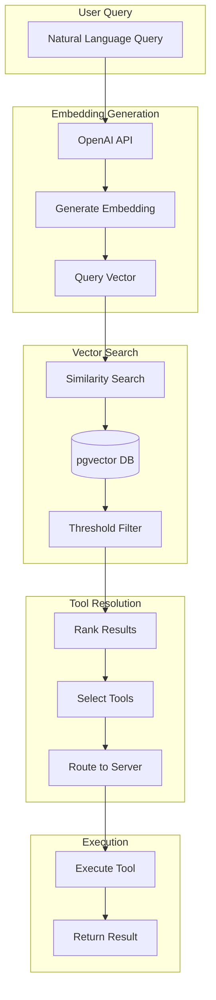

# Smart Routing

## AI-Powered Tool Discovery and Intelligent Routing System

Smart Routing is MCPHub's innovative feature that uses vector embeddings and semantic search to automatically discover and route requests to the most relevant tools across all connected MCP servers.

## 🎯 Overview

Smart Routing transforms how AI models interact with tools by:

1. **Semantic Understanding**: Converting tool descriptions to vector embeddings
2. **Intelligent Discovery**: Finding relevant tools based on query intent
3. **Dynamic Routing**: Automatically routing requests to appropriate servers
4. **Confidence Scoring**: Ranking results by semantic similarity

## 🏗️ Architecture



## 🔧 Setup Requirements

### 1. PostgreSQL with pgvector

```sql
-- Install pgvector extension
CREATE EXTENSION IF NOT EXISTS vector;

-- Create vector embeddings table
CREATE TABLE vector_embeddings (
  id SERIAL PRIMARY KEY,
  tool_name VARCHAR(255) NOT NULL,
  server_name VARCHAR(255) NOT NULL,
  description TEXT,
  input_schema JSONB,
  embedding vector(1536), -- OpenAI embedding dimension
  created_at TIMESTAMP DEFAULT CURRENT_TIMESTAMP,
  updated_at TIMESTAMP DEFAULT CURRENT_TIMESTAMP,
  
  -- Indexes for performance
  INDEX idx_embeddings_tool (tool_name),
  INDEX idx_embeddings_server (server_name),
  INDEX idx_embeddings_vector (embedding vector_cosine_ops)
);
```

### 2. Configuration

```typescript
// Smart routing configuration
{
  "systemConfig": {
    "smartRouting": {
      "enabled": true,
      "openaiApiKey": "sk-...",
      "embeddingModel": "text-embedding-3-small",
      "postgresConfig": {
        "host": "localhost",
        "port": 5432,
        "database": "mcphub",
        "user": "postgres",
        "password": "password"
      },
      "searchThreshold": 0.7,
      "maxResults": 10,
      "cacheEnabled": true,
      "cacheTTL": 3600
    }
  }
}
```

## 📊 Embedding Generation

### Tool Indexing

```typescript
class EmbeddingService {
  private openai: OpenAI;
  
  async generateToolEmbeddings(server: string, tools: ToolInfo[]) {
    for (const tool of tools) {
      // Create comprehensive text representation
      const text = this.createToolText(tool);
      
      // Generate embedding
      const embedding = await this.createEmbedding(text);
      
      // Store in database
      await this.storeEmbedding(server, tool, embedding);
    }
  }
  
  private createToolText(tool: ToolInfo): string {
    // Combine all relevant information
    const parts = [
      `Tool: ${tool.name}`,
      `Description: ${tool.description}`,
      `Parameters: ${this.formatParameters(tool.inputSchema)}`,
      `Category: ${this.inferCategory(tool)}`
    ];
    
    return parts.join('\n');
  }
  
  private async createEmbedding(text: string): Promise<number[]> {
    const response = await this.openai.embeddings.create({
      model: 'text-embedding-3-small',
      input: text,
      dimensions: 1536
    });
    
    return response.data[0].embedding;
  }
}
```

### Embedding Update Strategy

```typescript
class EmbeddingManager {
  async syncEmbeddings() {
    const servers = await this.getActiveServers();
    
    for (const server of servers) {
      const tools = await server.listTools();
      
      // Check for changes
      const existingEmbeddings = await this.getEmbeddings(server.name);
      const changes = this.detectChanges(tools, existingEmbeddings);
      
      // Update changed tools
      if (changes.added.length > 0) {
        await this.addEmbeddings(server.name, changes.added);
      }
      
      if (changes.removed.length > 0) {
        await this.removeEmbeddings(server.name, changes.removed);
      }
      
      if (changes.updated.length > 0) {
        await this.updateEmbeddings(server.name, changes.updated);
      }
    }
  }
}
```

## 🔍 Vector Search Implementation

### Search Algorithm

```typescript
class VectorSearchService {
  async searchTools(query: string, options?: SearchOptions): Promise<SearchResult[]> {
    // Generate query embedding
    const queryVector = await this.generateEmbedding(query);
    
    // Perform vector search
    const results = await this.performSearch(queryVector, options);
    
    // Post-process results
    return this.processResults(results, options);
  }
  
  private async performSearch(
    queryVector: number[],
    options?: SearchOptions
  ): Promise<RawResult[]> {
    const threshold = options?.threshold ?? 0.7;
    const limit = options?.limit ?? 10;
    
    // Cosine similarity search
    const query = `
      SELECT 
        tool_name,
        server_name,
        description,
        input_schema,
        1 - (embedding <=> $1::vector) as similarity
      FROM vector_embeddings
      WHERE 1 - (embedding <=> $1::vector) > $2
      ORDER BY similarity DESC
      LIMIT $3
    `;
    
    const result = await this.db.query(query, [queryVector, threshold, limit]);
    return result.rows;
  }
  
  private processResults(
    results: RawResult[],
    options?: SearchOptions
  ): SearchResult[] {
    return results.map(r => ({
      tool: r.tool_name,
      server: r.server_name,
      description: r.description,
      confidence: r.similarity,
      schema: r.input_schema,
      relevance: this.calculateRelevance(r, options)
    }));
  }
}
```

### Dynamic Threshold Adjustment

```typescript
class ThresholdManager {
  private historyWindow = 100;
  private successHistory: boolean[] = [];
  
  adjustThreshold(currentThreshold: number): number {
    // Calculate success rate
    const successRate = this.calculateSuccessRate();
    
    if (successRate < 0.6) {
      // Too many false positives, increase threshold
      return Math.min(currentThreshold + 0.05, 0.95);
    } else if (successRate > 0.9) {
      // Very high success, can lower threshold for more results
      return Math.max(currentThreshold - 0.05, 0.5);
    }
    
    return currentThreshold;
  }
  
  recordResult(wasRelevant: boolean) {
    this.successHistory.push(wasRelevant);
    
    // Keep window size
    if (this.successHistory.length > this.historyWindow) {
      this.successHistory.shift();
    }
  }
  
  private calculateSuccessRate(): number {
    if (this.successHistory.length === 0) return 0.7;
    
    const successes = this.successHistory.filter(s => s).length;
    return successes / this.successHistory.length;
  }
}
```

## 🎯 Smart Group Implementation

The `$smart` group provides two special tools for intelligent routing:

### 1. search_tools

```typescript
const searchToolsDefinition = {
  name: 'search_tools',
  description: 'Search for relevant tools based on a natural language query',
  inputSchema: {
    type: 'object',
    properties: {
      query: {
        type: 'string',
        description: 'Natural language description of what you want to do'
      },
      threshold: {
        type: 'number',
        description: 'Minimum similarity threshold (0-1)',
        default: 0.7
      },
      limit: {
        type: 'number',
        description: 'Maximum number of results',
        default: 10
      }
    },
    required: ['query']
  }
};

async function searchTools(args: any): Promise<any> {
  const { query, threshold, limit } = args;
  
  // Perform vector search
  const results = await vectorSearchService.searchTools(query, {
    threshold,
    limit
  });
  
  // Format results for display
  return {
    tools: results.map(r => ({
      name: r.tool,
      server: r.server,
      description: r.description,
      confidence: `${Math.round(r.confidence * 100)}%`,
      usage: `Use call_tool with server="${r.server}" and tool="${r.tool}"`
    })),
    total: results.length
  };
}
```

### 2. call_tool

```typescript
const callToolDefinition = {
  name: 'call_tool',
  description: 'Call a specific tool on a specific server',
  inputSchema: {
    type: 'object',
    properties: {
      server: {
        type: 'string',
        description: 'Name of the server containing the tool'
      },
      tool: {
        type: 'string',
        description: 'Name of the tool to execute'
      },
      arguments: {
        type: 'object',
        description: 'Arguments to pass to the tool'
      }
    },
    required: ['server', 'tool']
  }
};

async function callTool(args: any): Promise<any> {
  const { server, tool, arguments: toolArgs } = args;
  
  // Find the server
  const serverInfo = getServerByName(server);
  if (!serverInfo) {
    throw new Error(`Server not found: ${server}`);
  }
  
  // Validate tool exists
  const toolInfo = serverInfo.tools.find(t => t.name === tool);
  if (!toolInfo) {
    throw new Error(`Tool not found: ${tool} on server ${server}`);
  }
  
  // Execute the tool
  const result = await serverInfo.client.callTool(tool, toolArgs);
  
  // Record usage for analytics
  await recordToolUsage(server, tool, true);
  
  return result;
}
```

## 📈 Performance Optimization

### Caching Strategy

```typescript
class EmbeddingCache {
  private cache = new Map<string, CachedEmbedding>();
  private ttl = 3600000; // 1 hour
  
  async getEmbedding(text: string): Promise<number[]> {
    const cacheKey = this.hash(text);
    const cached = this.cache.get(cacheKey);
    
    if (cached && Date.now() - cached.timestamp < this.ttl) {
      return cached.embedding;
    }
    
    // Generate new embedding
    const embedding = await this.generateEmbedding(text);
    
    // Cache it
    this.cache.set(cacheKey, {
      embedding,
      timestamp: Date.now()
    });
    
    return embedding;
  }
  
  private hash(text: string): string {
    return crypto.createHash('sha256').update(text).digest('hex');
  }
}
```

### Batch Processing

```typescript
class BatchEmbeddingProcessor {
  private batchSize = 100;
  private queue: QueueItem[] = [];
  
  async processBatch(items: string[]): Promise<number[][]> {
    const batches = this.chunk(items, this.batchSize);
    const results: number[][] = [];
    
    for (const batch of batches) {
      const embeddings = await this.openai.embeddings.create({
        model: 'text-embedding-3-small',
        input: batch
      });
      
      results.push(...embeddings.data.map(d => d.embedding));
    }
    
    return results;
  }
  
  private chunk<T>(array: T[], size: number): T[][] {
    const chunks: T[][] = [];
    for (let i = 0; i < array.length; i += size) {
      chunks.push(array.slice(i, i + size));
    }
    return chunks;
  }
}
```

## 🔍 Query Enhancement

### Query Expansion

```typescript
class QueryEnhancer {
  async enhanceQuery(originalQuery: string): Promise<string[]> {
    const queries = [originalQuery];
    
    // Add synonyms
    const synonyms = await this.getSynonyms(originalQuery);
    queries.push(...synonyms);
    
    // Add related terms
    const related = await this.getRelatedTerms(originalQuery);
    queries.push(...related);
    
    // Generate variations
    const variations = this.generateVariations(originalQuery);
    queries.push(...variations);
    
    return queries;
  }
  
  private generateVariations(query: string): string[] {
    const variations = [];
    
    // Add action verbs if missing
    if (!this.hasActionVerb(query)) {
      variations.push(`execute ${query}`);
      variations.push(`run ${query}`);
      variations.push(`perform ${query}`);
    }
    
    // Add context
    variations.push(`I want to ${query}`);
    variations.push(`Help me ${query}`);
    
    return variations;
  }
}
```

## 📊 Analytics and Learning

### Usage Tracking

```typescript
interface ToolUsage {
  query: string;
  selectedTool: string;
  server: string;
  confidence: number;
  wasSuccessful: boolean;
  timestamp: Date;
}

class UsageAnalytics {
  async recordUsage(usage: ToolUsage) {
    // Store in database
    await this.db.insert('tool_usage', usage);
    
    // Update tool popularity
    await this.updatePopularity(usage.selectedTool);
    
    // Adjust thresholds based on success
    if (!usage.wasSuccessful && usage.confidence > 0.8) {
      // High confidence but failed - might need retraining
      await this.flagForReview(usage);
    }
  }
  
  async getInsights(): Promise<Insights> {
    return {
      mostUsedTools: await this.getMostUsedTools(),
      averageConfidence: await this.getAverageConfidence(),
      successRate: await this.getSuccessRate(),
      problemQueries: await this.getProblematicQueries()
    };
  }
}
```

## 🚀 Usage Examples

### Example 1: Natural Language Query

```typescript
// User query: "I need to check the weather in San Francisco"

// 1. Generate embedding for query
const queryEmbedding = await generateEmbedding(
  "I need to check the weather in San Francisco"
);

// 2. Search for similar tools
const results = await searchSimilarTools(queryEmbedding);
// Returns: [
//   { tool: "get_weather", server: "weather-api", confidence: 0.92 },
//   { tool: "weather_forecast", server: "climate-service", confidence: 0.85 }
// ]

// 3. Execute the best match
const weather = await callTool("weather-api", "get_weather", {
  location: "San Francisco"
});
```

### Example 2: Complex Query

```typescript
// User query: "Analyze sentiment of latest tweets about AI and create a summary report"

// Smart routing breaks this into sub-tasks:
const tasks = await analyzeComplexQuery(query);
// Returns:
// 1. search_tweets (twitter-server)
// 2. analyze_sentiment (nlp-server)
// 3. generate_report (document-server)

// Execute in sequence
const tweets = await callTool("twitter-server", "search_tweets", { query: "AI" });
const sentiment = await callTool("nlp-server", "analyze_sentiment", { texts: tweets });
const report = await callTool("document-server", "generate_report", { data: sentiment });
```

## 🔧 Troubleshooting

### Common Issues

1. **Low Confidence Scores**
   - Improve tool descriptions
   - Add more context to tool names
   - Include examples in descriptions

2. **Incorrect Tool Selection**
   - Review embedding generation
   - Adjust similarity threshold
   - Add negative examples

3. **Performance Issues**
   - Enable caching
   - Optimize database indexes
   - Use batch processing

## 📚 Related Documentation

- [System Overview](01-system-overview.md) - Architecture overview
- [Service Layer](05-service-layer.md) - Vector search service
- [Data Flow](04-data-flow.md) - Smart routing flow
- [API Reference](10-api-reference.md) - Smart routing endpoints

---

*Next: [API Reference →](10-api-reference.md)*